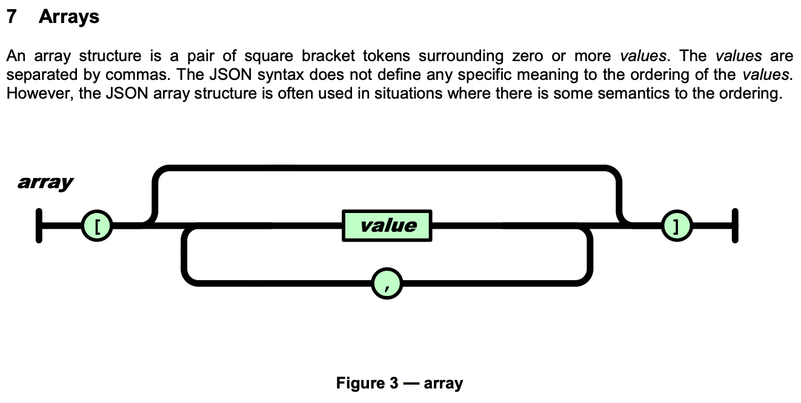

# ECMAScript와 JavaScript의 연관성

> **Create Date**: 2022/12/09  
> **Update Date**: 2023/01/01
>
> [노션에서 확인하기](https://areumsheep.notion.site/ECMAScript-JavaScript-a8caaaa4f32444408d67eaf3346b4efa)

ES6, ES2016, ES2021 등등 ES가 들어가는 말들을 보신 적이 있을 겁니다.
혹시 ES6가 무엇인지 설명할 수 있으신 분이 계실까요?

## ECMAScript

> **ECMA스크립트**(ECMAScript, 또는 ES)란, [Ecma International](https://ko.wikipedia.org/wiki/Ecma_%EC%9D%B8%ED%84%B0%EB%82%B4%EC%85%94%EB%84%90)이 **ECMA-262** 기술 규격에 따라 정의하고 있는 표준화된 스크립트 프로그래밍 언어를 말한다.
>
> [https://ko.wikipedia.org/wiki/ECMA스크립트](https://ko.wikipedia.org/wiki/ECMA%EC%8A%A4%ED%81%AC%EB%A6%BD%ED%8A%B8)

이해가 어렵네요…. 하나하나 짚어보며 이해해봅시다.

### **Ecma International**

정보와 통신 시스템 표준을 정하는 기구입니다.
과거에 Netscape가 Microsoft의 IE 독점을 막기 위해 `야 우리 표준 만들자!!` 하며 불러낸 기구이죠.

### ECMA-262

```json
{
	"name": "양아름",
	"hobby": ["유튜브 보기", "롤 하기"]
},
{
	"name": "안유진",
	"age": 20,
	"group": "아이즈원...."
}
```

위에 작성된 파일의 **확장자**는 무엇일까요?

맞습니다! JSON이죠!  
누가 JSON에 `[` 문자와 `]` 를 이용하여 배열을 만든다고 정의했을까요?  
누가 이름을 `"` 문자를 이용해서 문자열을 만든다고 정의했을까요?  
**Ecma International** 입니다!!!!!!!!  
이렇게 표준을 생성하고 그걸 문서화하는 것이 해당 기구에서 하는 업무 중 하나입니다.  
실제로 위와 같은 표준은 [ECMA-404](https://www.ecma-international.org/publications-and-standards/standards/ecma-404/)에 정의되어 있습니다.


ECMA-404는 **JSON 파일의 표준이 담긴 가이드**의 이름입니다.

**그렇다면 ECMA-262는?!**
맞습니다! **ECMAScript의 표준이 담긴 가이드**의 이름입니다.

위 코드는 그냥 콘솔에 `hello world!!!` 를 출력하는 코드입니다.
console에는 log 함수가 있고, log 함수는 파라미터를 여러 개 받을 수 있습니다.
또, log라는 함수는 콘솔에 출력을 해야합니다.
이러한 표준을 정의하여 정리해놓은 가이드를 **ECMA-262**라고 합니다.

### ES(n) - ES6, ES7…

ECMA-262의 버전에 따라 불리는 이름입니다. 현재는 **ES2021** 이런 식으로 년도를 붙여 부르기도 합니다.
처음에 ES6가 무엇인지에 대한 답변은 ECMA-262에 6번째로 정의된 가이드라고 하시면 좋을 것 같습니다.

](images/ECMAScript와-JavaScript의-연관성/Untitled%202.png)

[https://www.ecma-international.org/publications-and-standards/standards/ecma-262/](https://www.ecma-international.org/publications-and-standards/standards/ecma-262/)

- **그럼 ES6를 다르게 표현해본다면?!**
  **ES2015** 입니다.

### **ECMAScript**

ECMA-262 가이드에 정의된 규격에 따라 **표준화 된 스크립트 프로그래밍 언어**를 말합니다.

## JavaScript

ECMA-262 사양을 준수하는 **범용 스크립팅 언어**입니다.

## 흠 생각보다 어려운데요?

그럼 이렇게 간단하게 생각해보세요!

- **Ecma International**: 국립국어원
- **ECMA-262**: 국어사전
- **ECMAScript**: 표준어
- **JavaScript**: 방언

ECMAScript 문서를 읽게 된다면, 여러분은 **어떻게 스크립트 언어를 만들 수 있는지**를 알 수 있습니다.
반면 여러분이 JavaScript 문서를 읽게 된다면, 여러분은 **어떻게 스크립트 언어를 쓸 수 있는지**를 알 수 있습니다.

## 참고자료

- [https://wormwlrm.github.io/2018/10/03/What-is-the-difference-between-javascript-and-ecmascript.html](https://wormwlrm.github.io/2018/10/03/What-is-the-difference-between-javascript-and-ecmascript.html)
- [https://www.freecodecamp.org/news/whats-the-difference-between-javascript-and-ecmascript-cba48c73a2b5](https://www.freecodecamp.org/news/whats-the-difference-between-javascript-and-ecmascript-cba48c73a2b5)
