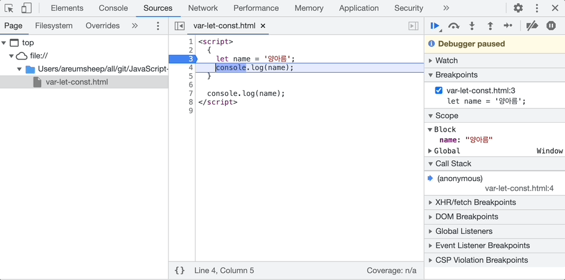
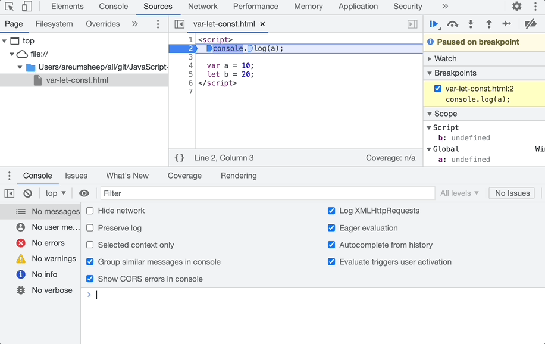
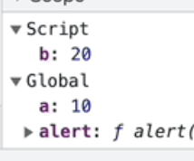
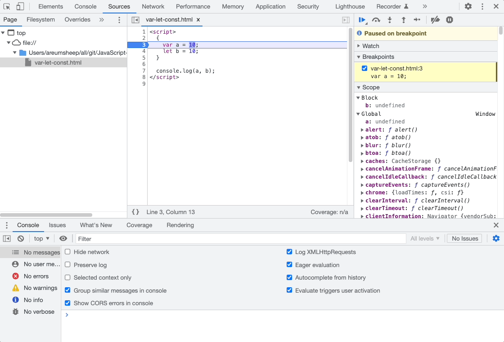

# var / let / const

> **Create Date**: 2022/12/09  
> [노션에서 확인하기](https://areumsheep.notion.site/var-let-const-685a665d15e74ed0a65558d56c76230d)

자바스크립트에는 타입이 없습니다.
그럼 변수 선언을 어떻게 해야할까요?

**var**, **let**, **const** 키워드를 이용해 변수 선언을 할 수 있습니다!

다들 이 키워드에 대해 익숙하겠지만, 조금만 더 깊게 다가가봅시다.

## Scope란?

자바스크립트 **scope**에 관하여 이야기를 해봅시다.

저는 대한민국에서 태어났습니다. 대한민국 국적을 가지고 있습니다.
근데 미국에서 살고싶어요. 가능한가요?

가능은 하겠지만 오랫동안 살기 위해선 미국 국적을 가져야 합니다.
왜냐하면 제 국적이 유효한 범위는 대한민국 내에서만 가능하기 때문이죠.

```jsx
// 자바스크립트에서의 Block은 {} 라고 생각하시면 쉽습니다.
{
  let name = '양아름';
}

console.log(name);
```

name은 Block scope에서 태어났습니다.
근데 Global scope에서 출력되고 싶어요. 가능한가요?

안됩니다! Block scope는 Block을 빠져나오면 안에 있던 모든 것들이 사라집니다.



|                      | var | let | const |
| -------------------- | --- | --- | ----- |
| Global Scope         | O   | X   | X     |
| Script Scope         | X   | O   | O     |
| function local Scope | O   | O   | O     |
| Block Scope          | X   | O   | O     |

### Global Scope / Script Scope





### function local Scope


### Block Scope



결론적으로 Scope는 변수 선언하는 위치에 따라 아래와 같은 순서로 저장되게 됩니다.

1. Global ↔ Script
2. Function Local
3. Block

## var

ES6 전의 자바스크립트 변수 선언 방법입니다. ES6에서 let, const가 생기게 되었습니다.

### 1) 함수 레벨 스코프

자바스크립트는 함수 레벨 스코프를 따릅니다.
함수 레벨 스코프는 함수 코드 블록 내에서 선언된 변수는 함수 코드 블록 내에만 유효하고 함수 외부에서 유효하지 않다는 것입니다.

코드와 함께 봅시다!

```jsx
var x = 'global';

function foo() {
  var x = 'local';
  console.log(x); //?
}

foo();
console.log(x); //?
```

- **위 ?에서는 순서대로 어떤 값이 출력될까요?**
  local와 global이 출력됩니다.
  

```jsx
var x = 1;
{
  // Block
  var x = 2;
  console.log(x); //?
}
console.log(x); //?
```

- **위 ?에서는 순서대로 어떤 값이 출력될까요?**
  2와 2가 출력됩니다.
  

### 2) 전역 변수

함수 바디 바깥에서 선언된 var는 전역 변수로 선언됩니다.
또, 전역 객체의 프로퍼티로 존재합니다.


```jsx
var test = 'test';
globalThis.test = 'test'; //위 코드와 동일한 의미가 됩니다.
```

### 3) 재선언 가능

```jsx
var name = '양아름';
var name = '다시 설정';
```

### 4) 호이스팅

지금은 잠시 넘어가겠습니다!

## let / const

`let`은 var와 비슷하게 재할당이 가능한 키워드이며,
`const`는 let과 거의 비슷하지만 선언할 때 반드시 값을 할당하여 초기화해야 한다는 점이 다릅니다.

`let` 은 변수를 선언할 때, `const` 는 상수를 선언할 때 주로 사용합니다.

```jsx
let name = '양아름';
name = '새로운 이름';

const PI = 3.141592;
```

### 1) 블럭 레벨 스코프

이 두 가지 키워드는 블럭 레벨 스코프를 가집니다.

위에서 var 키워드로 예시를 들었던 코드를 가져와서 let으로 고쳐보겠습니다.

```jsx
let x = 1;
{
  let x = 2;
  console.log(x); //?
}
console.log(x); //?
```

- **과연 달라졌을까요?**
  
  

### 2) TDZ

잠시 넘어가겠습니다!

## 정리

|                      | var | let | const |
| -------------------- | --- | --- | ----- |
| Global Scope         | O   | X   | X     |
| Script Scope         | X   | O   | O     |
| function local Scope | O   | O   | O     |
| Block Scope          | X   | O   | O     |
| 재선언               | O   | X   | X     |
| 재할당               | O   | O   | X     |

## 🤔 다음 주 발표 미리보기

```jsx
const name = '양아름';
name = '이름'; // Uncaught TypeError: Assignment to constant variable.

const hobby = ['유튜브 보기', '나노블럭 맞추기'];
hobby.push('새로운 취미!!'); // 가능?!
```

`const` 는 상수를 선언할 때 주로 사용한다고 설명했습니다.

그럼 배열 메소드를 사용해 값을 추가한다면 과연 에러가 발생할까요?

## 출처

- [https://poiemaweb.com/js-scope](https://poiemaweb.com/js-scope)
- [https://poiemaweb.com/es6-block-scope](https://poiemaweb.com/es6-block-scope)
- [https://www.youtube.com/watch?v=61iolhWgQt0](https://www.youtube.com/watch?v=61iolhWgQt0)
