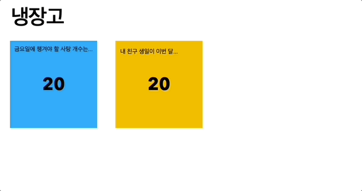

# 타입

> **Create Date**: 2022/12/14  
> **Update Date**: 2022/12/16
>
> [노션에서 확인하기](https://areumsheep.notion.site/a0b7d622868d434785904b43a7c3c810)

프로그래밍 언어에서 어떤 타입을 지원하는지가 프로그래밍 언어의 가장 기본적인 특징이 됩니다.
자바스크립트의 변수 타입은 크게 원시 타입과 참조 타입이 있습니다.

](images/타입/Untitled.png)

**출처**: [https://www.javascripttutorial.net/javascript-data-types/](https://www.javascripttutorial.net/javascript-data-types/)

왼쪽이 원시 타입이고 참조 타입은 오른쪽 입니다.

## 원시 타입…?

외우지 않고 이해를 해봅시다…
좀 쉽게 변수가 포스트잇이라고 생각을 해볼까요?

- 포스트잇은 작아서 적을 수 있는 정보의 양이 제한되어 있습니다.
- 포스트잇에는 아래의 값들을 적을 수 있습니다.
  - 예, 아니오 (boolean)
  - 내 나이 (number)
  - 내 이름 (string)
  - 안 적기 (undefined)
  - 나에게 필요없는 정보 (null)
  - 등등….
- **볼펜으로 작성된 포스트잇에는 다른 새로운 값을 작성할 수 없습니다**. (불변성)

저는 금요일에 챙겨야 할 사탕 개수를 기억시키기 위해 매일 보는 냉장고에 사탕개수 **20이라는 메모지를** 붙여놨습니다.

근데 생각해보니 친구 생일도 까먹지 않아야 하기에 **20일**이라는 뜻의 메모지를 하나 더 붙였습니다.


둘 다 동일한 20을 가르키고 있습니다. 보기에도 다르게 느껴지지 않습니다. 코드로는 이렇게 표현할 수 있겠네요!

```javascript
let 사탕_개수 = 20;
let 친구_생일 = 20;

console.log(사탕_개수 === 친구_생일); // => true
```

아 맞다… 친구 생일이 20일이 아니라 18일이었네요 하마터면 친구와 사이가 나빠질 뻔 했습니다.

포스트잇에 볼펜으로 썼더니 기존에 사용했던 포스트잇은 재사용하긴 어려워보이네요… (지구야 미안🥲)



새로운 메모지를 붙이고 타이틀을 다른 메모지로 넘겨줍니다.
이 움짤을 자바스크립트 변수로 바꿔본다면 이렇습니다.


100이라는 값이 담긴 메모리는 이제 사용되지 않기에 GC(가비지 콜렉터)가 정리합니다.

선언문에서 a는 100이라는 값이 담긴 메모리 주소를 가집니다.
그 후 재할당을 할 때는 100이라는 값이 수정되는 것이 아닌 50을 다른 메모리에 담고 그 메모리 주소를 가져옵니다.

```javascript
Object.getOwnPropertyDescriptor('hello!', 0);
// writable false로 설정되어 있습니다.
```

## 참조 타입……?

참조 타입은 C언어의 포인터와 비슷합니다.

어머니께서 긴 종이에 음식 레시피를 적고 음식 레시피를 모아두는 위치를 포스트잇으로 냉장고에 붙여두셨습니다.


이걸 프로그래밍 사고로 생각해보자면…

1. 실제 객체(음식 레시피)는 컴퓨터 옆에 있습니다.
2. 메모지는 찾을 위치(객체의 주소)를 알려줍니다.


어머니께서 제가 잊어버릴까봐 새로운 레시피의 위치를 카톡으로도 알려주셨습니다.

포스트잇이 가리키는 음식 레시피와 카톡에서 가리키는 음식 레시피는 같은 정보를 담고 있지만 실제로는 다른 위치에 존재합니다.

코드로 표현해볼까요?

```javascript
let 컴퓨터_옆_레시피 = ['1. 물을 넣는다.', '2. 물이 끓을 때까지 기다린다.'];
let 책상_위_레시피 = ['1. 물을 넣는다.', '2. 물이 끓을 때까지 기다린다.'];

let 포스트잇_레시피 = 컴퓨터_옆_레시피;
let 카톡_레시피 = 책상_위_레시피;

console.log(메모지_레시피 === 카톡_레시피); // => false
```

하지만 이렇게 바꾸면 어떨까요?


카톡으로도 새로운 레시피의 위치를 참고하는 것이 아닌 같은 레시피를 이야기하고 있습니다.

코드로 표현해보면…

```javascript
let 컴퓨터_옆_레시피 = ['1. 물을 넣는다.', '2. 물이 끓을 때까지 기다린다.'];
// let 책상_위_레시피 = ['1. 물을 넣는다.', '2. 물이 끓을 때까지 기다린다.'];

let 포스트잇_레시피 = 컴퓨터_옆_레시피;
let 카톡_레시피 = 컴퓨터_옆_레시피;

console.log(메모지_레시피 === 카톡_레시피); // => true
```

이걸 다시 자바스크립트 변수로 바꿔보면 아래 그림과 같습니다.


```javascript
const 레시피 = {
  라면: ['1. 물을 넣는다.', '2. 물이 끓을 때까지 기다린다.'],
};
Object.getOwnPropertyDescriptor(레시피, '라면');
```

## TMI) 가비지 컬렉션

위 원시타입을 이야기할 때 잠시 가비지 컬렉션이 실행된다고 말씀드렸습니다.

가비지 컬렉션은 알고 계신 분들이 더 많을 것 같은데 **일종의 메모리 청소부**라고 생각하시면 좋습니다.
저희가 놓쳤던 메모리를 자바스크립트에서 영차영차 하며 **사용되지 않는 메모리를 정리**해주는 거죠!

C언어에선 직접 free(), malloc()을 사용하여 메모리를 정리할 수 있습니다.

가비지 컬렉션은 **도달 가능성** 이라는 개념을 사용해 메모리 관리를 수행합니다.
내부로는 'mark-and-sweep’이라 불리는 가비지 컬렉션 기본 알고리즘이 동작하고 있습니다.

같이 살펴볼까요?


오른쪽에 다가갈 수 없는 섬이 보입니다. ‘mark-and-sweep’ 알고리즘은 이렇게 작동됩니다.


루트에서 시작하여 첫번째 단계에 있는 값들을 **mark** 합니다.


도달 가능한 모든 객체를 방문할 때까지 mark 한 객체가 참조하는 객체를 계속해서 mark 합니다.


도달할 수 없었던, 도달 가능성이 없는 객체를 메모리에서 삭제합니다.


100으로 가는 길이 이어져 있지 않습니다.
GC가 삭제합니다.

저희는 이렇게 원시 타입, 참조타입, 가비지 컬렉션에 대해 알아보았습니다.

값이 메모리에 어떻게 저장이 되는지 추후 다루기에 자세히 말씀드리지 않았지만,
아래의 그림을 참고하시면 좋을 것 같습니다!


## 참고

- 자바스크립트 완벽 가이드
- [https://developer.mozilla.org/ko/docs/Web/JavaScript/Memory_Management](https://developer.mozilla.org/ko/docs/Web/JavaScript/Memory_Management)
- [https://velog.io/@nomadhash/Java-Script-깊은-복사와-얕은-복사](https://velog.io/@nomadhash/Java-Script-%EA%B9%8A%EC%9D%80-%EB%B3%B5%EC%82%AC%EC%99%80-%EC%96%95%EC%9D%80-%EB%B3%B5%EC%82%AC)
- [https://stackoverflow.com/questions/13266616/primitive-value-vs-reference-value/13268731#13268731](https://stackoverflow.com/questions/13266616/primitive-value-vs-reference-value/13268731#13268731)
- [https://developer.mozilla.org/en-US/docs/Glossary/Primitive](https://developer.mozilla.org/en-US/docs/Glossary/Primitive)
- [https://github.com/woowa-study-js/woowa-ebook/issues/11](https://github.com/woowa-study-js/woowa-ebook/issues/11)
- [https://developer.mozilla.org/ko/docs/Web/JavaScript/Memory_Management](https://developer.mozilla.org/ko/docs/Web/JavaScript/Memory_Management)
- [https://ko.javascript.info/garbage-collection](https://ko.javascript.info/garbage-collection)
