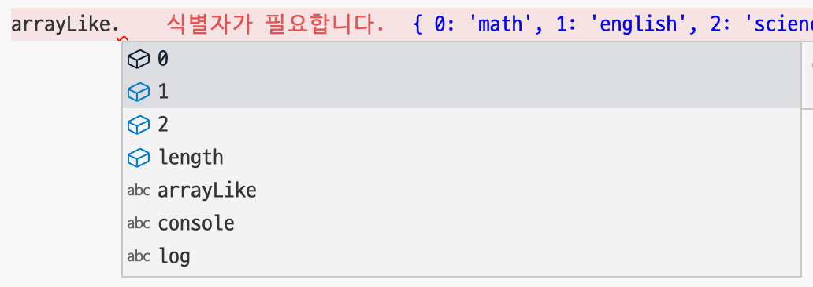

# 배열 비슷한 객체

> **Create Date**: 2022/12/21  
> **Update Date**: 2022/12/21
>
> [노션에서 확인하기](https://areumsheep.notion.site/e7a1dea647e94b7984a81324fd249d49)

자바스크립트에는 배열과 비슷한 객체가 존재합니다.
영어로는 array-like object라고 합니다.

코드를 봐볼까요?

```jsx
const arrayLike = {
  0: 'math',
  1: 'english',
  2: 'science',
  length: 3,
};

console.log(arrayLike[0]); // => math
```

콘솔로 출력하는 부분을 보면 기존 배열과 비슷하게 동작하는 걸 보실 수 있습니다!
하지만 가장 큰 차이점은…!!

push, indexOf, forEach 같은 배열 메서드가 없다는 것입니다.



자동완성에도 뜨지 않습니다.

## 알아야 하는 이유는…?

> vanilla JS를 사용하다보면 array-like object를 리턴하는 DOM API가 있습니다.
> 이걸 인식하지 못한다면 배열로 해석하고 `왜 배열 메서드가 작동하지 않지?` 하며 고민에 빠질 수 있습니다.
>
> array-like object를 인식하고 처리하는 방법을 안다면 쉽게 해결할 수 있을 것입니다!!
>
> **출처**: [https://daily.dev/blog/why-do-you-need-to-know-about-array-like-objects](https://daily.dev/blog/why-do-you-need-to-know-about-array-like-objects)

## 우리 주변에 존재하는 array-like object

### arguments

```jsx
function test() {
  for (const argument of arguments) {
    console.log(argument);
  }
}

test('a', 'b', 'c');
```

예전에는 나머지 연산자 (…) 가 존재하지 않아 **arguments**를 사용하는 것이 모든 인수를 얻는 유일한 방법이었습니다. (화살표 함수에서 arguments에 접근하면 외부 함수에서 arguments를 찾습니다.)

여기서 arguments는 array-like object입니다.
위 코드를 forEach로 사용하려면 에러가 발생합니다.


### querySelectorAll

```jsx
const items = document.querySelectorAll('.items');
```

클래스 명이 items인 모든 element를 가져오는 코드입니다.
해당 코드의 리턴 값은 NodeList이며 NodeList는 array-like object입니다.

## array-like를 사용하는 것이 좋을까요?

```jsx
Array.prototype.forEach.call(arrayLike, (value, index) => {
  console.log(`${index}: ${value}`);
});
// This logs '0: a', then '1: b', and finally '2: c'.
```

array-like object를 이렇게 이용한다면 배열 메서드를 사용할 수도 있습니다.
그럼 array-like 사용을 지향하는 것이 과연 좋을까요…?

크롬에 내장되어 있는 자바스크립트 엔진을 만든 V8의 블로그를 보면 array-like object보다 array가 더 최적화가 되어있다고 합니다.

그렇기에 배열 내장 기능을 두 번 이상 사용할 계획이라면 실제 배열로 전환하여 사용하는 것을 추천합니다.

> ⛰️ However, this is slower than calling `forEach` on a proper array, which is highly optimized in V8. If you plan on using array built-ins on this object more than once, consider turning it into an actual array beforehand:
> In general, avoid array-like objects whenever possible and use proper arrays instead.
>
> **그러나 이것은 V8에서 고도로 최적화된 배열에서 forEach로 호출하는 것보다 느립니다. 해당 객체에서 배열 내장 기능을 두 번 이상 사용할 계획이라면 사전에 실제 배열로 전환하는 것을 고려하십시오.
> 일반적으로 가능하면 항상 배열과 같은 객체를 피하고 적절한 배열을 대신 사용하십시오.**
>
> 출처: [https://v8.dev/blog/elements-kinds#prefer-arrays-over-array-like-objects](https://v8.dev/blog/elements-kinds#prefer-arrays-over-array-like-objects)

## 참고 자료

- [https://developer.mozilla.org/en-US/docs/Web/JavaScript/Reference/Global_Objects/Array](https://developer.mozilla.org/en-US/docs/Web/JavaScript/Reference/Global_Objects/Array)
- [https://developer.mozilla.org/en-US/docs/Web/JavaScript/Guide/Indexed_collections#working_with_array-like_objects](https://developer.mozilla.org/en-US/docs/Web/JavaScript/Guide/Indexed_collections#working_with_array-like_objects)
- [https://v8.dev/blog/elements-kinds#prefer-arrays-over-array-like-objects](https://v8.dev/blog/elements-kinds#prefer-arrays-over-array-like-objects)
- [https://daily.dev/blog/why-do-you-need-to-know-about-array-like-objects](https://daily.dev/blog/why-do-you-need-to-know-about-array-like-objects)
- [https://2ality.com/2013/05/quirk-array-like-objects.html](https://2ality.com/2013/05/quirk-array-like-objects.html)
- [https://www.oreilly.com/library/view/javascript-the-definitive/9781449393854/ch07s11.html](https://www.oreilly.com/library/view/javascript-the-definitive/9781449393854/ch07s11.html)
- [https://javascript.info/rest-parameters-spread](https://javascript.info/rest-parameters-spread)
