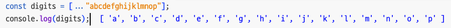

# 배열 / 성긴 배열

> **Create Date**: 2022/12/21  
> **Update Date**: 2022/12/22
>
> [노션에서 확인하기](https://areumsheep.notion.site/5e4b76a797c6495186f38865a2aeec30)

여러분들은 배열에 대해 잘 알고 계실겁니다.
하지만 조금 더 세세하게 알아보는 계기가 되었으면 하여 준비한 자료입니다!

## 배열 생성하는 방법

배열을 만드는 방법은 여러가지입니다.

### 배열 리터럴

```jsx
const empty = [];
const misc = [1.1, true, 'a']; //타입이 다른 요소가 세 개 있고 콤마로 끝난 배열

const 성긴_배열 = [1, , 3]; // 이게 바로 성긴 배열입니다.
성긴_배열[1]; // => undefined
```

**성긴 배열**은 배열 리터럴에 콤마를 연속해서 썼는데 그 사이에 값이 없는 배열입니다.
값을 생략한 위치에 실제로 배열 요소가 존재하진 않지만 검색하면 undefined가 리턴됩니다.

### 분해 연산자

```jsx
const a = [1, 2, 3];
const b = [0, ...a, 4]; // => 0,1,2,3,4
```

분해 연산자는 배열을 얕게 복사할 때도 유용합니다.
또, 분해 연산자는 모든 이터러블 객체에서 동작하기에 이터러블인 문자열도 분해 연산자를 사용할 수 있습니다.

> 현재의 이터러블 객체는 **for/of 루프의 대상이 될 수 있는 객체**라고 생각하셔도 좋습니다!

```jsx
const digits = [...'abcdefghijklmnop'];
```



### Array() 생성자

```jsx
// 1) 인자 없이 호출
const a = new Array(); // []

// 2) 배열 길이를 나타내는 숫자 인자 하나로 호출
const b = new Array(10); // => [10] (X) / [ , , , , , , , , ,  ] (O) length - 10

// 3) 배열 요소를 두 개 이상 쓰거나, 숫자가 아닌 요소를 하나만 넘겨 호출
const c = new Array(5, 4, 3, 2, 1, 'testing'); // => [ 5, 4, 3, 2, 1, 'testing' ]
new Array('test'); // => ["test"];
```

### Array.of()

Array() 생성자를 사용하면 숫자 하나의 인자를 넘기면 그 숫자인 배열이 생성됩니다.
ES6에서는 이 문제점을 해결합니다.

```jsx
Array.of(); // => []
Array.of(10); // => [10]
```

### Array.from()

Array.from()도 ES6에서 생성된 중요한 메서드입니다.

이 메서드는 첫 번째 인자로 이터러블 객체나 배열 비슷한 객체(array-like object)를 받으며 새 배열을 만들어 반환합니다.

```jsx
const copy = Array.from(original);
```

다음과 같이 쉽게 복사할 수 있습니다.

중요한 메서드인 이유는 **array-like object를 진정한 배열로 바꾸는 방법**이기 때문입니다!!!!
웹 브라우저 메서드(DOM API)의 일부가 배열 비슷한 객체를 반환하므로 이들을 배열로 변환하면 작업이 간단해질 때가 많습니다.

또, Array.from()은 선택 사항으로 두 번째 인자를 받습니다.
두 번째 인자로 함수를 넘기면 새 배열을 생성할 때 첫 번째 인자의 배열을 이 함수에게 전달하고 반환 값을 배열에 저장합니다.

```jsx
const a = Array.from([1, 2, 3], (x) => x + x); // => [2, 4, 6]
```

동적으로 배열을 생성할 때는 `Array() - fill() - map()` / `Array.from( () => {} )` 중 후자가 더 좋습니다.

```jsx
// 1) Array + fill + map
console.log(
  Array(5) // 1. [,,,,]
    .fill(0) // 2. [0,0,0,0,0]
    .map((item, index) => item + index + 1) // 3. [1,2,3,4,5]
);

// 2) Array.from()
console.log(Array.from([0, 0, 0, 0, 0], (item, index) => item + index + 1));
```

Array() - fill() - map()을 사용하면 Array()를 fill()하며 한 번씩 반복할 것입니다.
또, map() 까지 반복하여 돈다면 Array.from()으로 콜백함수를 도는 것보다 더 시간이 소요됩니다.

Array.from() 으로 새 배열을 생성할 때 각 요소를 함수에 전달하고 반환 값을 저장한다면 2번 반복되지 않기에 더 빠르게 결과를 가질 수 있습니다.

## 성긴 배열 (희소 배열)

위에서 잠깐 이야기했지만, 성긴 배열은 **인덱스가 연속적이지 않은 배열**입니다.

일반적으로 배열의 length는 배열의 포함된 요소의 개수입니다. 하지만 성긴 배열의 경우 length가 요소 개수보다 큽니다.

```jsx
const a = [1, , , 5];
// 요소 개수: 2
// length: 4
```

대부분의 자바스크립트 배열은 성기지 않은 배열입니다.

실제로 성긴 배열을 다뤄야 할 때가 있더라도 아마 코드에서는 그 배열을 undefined 요소가 포함된 빽빽한 배열로 취급할 것입니다.

```jsx
console.log(a[1]); // => undefined
```

## 참고 자료

- 자바스크립트 완벽가이드
- [https://developer.mozilla.org/ko/docs/Web/JavaScript/Reference/Global_Objects/Array/fill](https://developer.mozilla.org/ko/docs/Web/JavaScript/Reference/Global_Objects/Array/fill)
