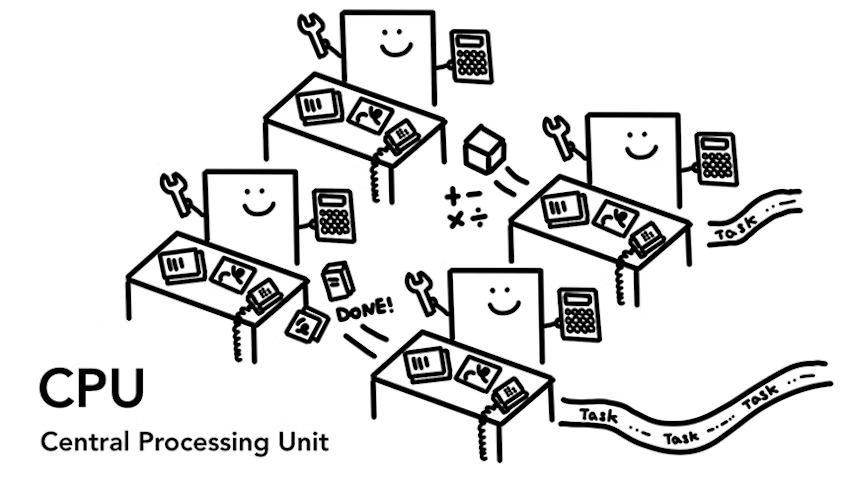

# Chrome의 내부 동작 1편

> **Create Date**: 2023/01/13  
> **Update Date**: 2023/01/13
>
> [Inside look at modern web browser (part1)](https://developer.chrome.com/blog/inside-browser-part1/)을 번역한 글입니다.  
> 오역이 있을 수 있습니다.

해당 글은 4부로 나뉘어 있으며 시리즈에서는 높은 수준의 아키텍처에서 렌더링 파이프라인의 세부 사항까지 Chrome 브라우저의 내부를 살펴볼 예정입니다.

브라우저가 코드를 기능적인 웹사이트로 변환하는 방법이 궁금하거나 성능 향상을 위해 특정 기술이 제안되는 이유가 확실하지 않을 경우에 이 글이 도움이 될 것입니다!

1부에서는 핵심 컴퓨팅 용어와 크롬의 다중 프로세스 아키텍처에 대해 알아볼 예정입니다.

## 컴퓨터의 핵심인 CPU와 GPU

브라우저가 실행되는 환경을 이해하기 위해선 몇 가지 컴퓨터 부품과 그 기능을 이해해야 합니다.

### CPU

그림1: 각 책상에 앉아 사무원처럼 들어오는 작업을 처리하는 4개의 CPU 코어

첫 번째로 다룰 내용은 **C**entral **P**rocessing **U**nit (CPU) 입니다.
CPU는 당신의 컴퓨터의 두뇌라고 할 수 있습니다.

그림에서 사무원처럼 일하고 있는 CPU 코어는 들어오는 매우 많은 일을 하나씩 처리할 수 있습니다.
CPU는 고객의 전화를 답변하는 방법도 알고 있으며 수학부터 미술까지 모든 것을 처리할 수 있습니다. (그림)

과거에서는 대부분의 CPU는 단일 칩이었습니다.
그 당시 코어는 같은 칩에 들어있을 뿐 다른 CPU라고 볼 수 있었습니다.

현재의 휴대폰과 노트북에서는 둘 이상의 코어를 사용하여 더 많은 컴퓨팅 성능을 제공하는 경우가 많습니다.

](images/Chrome의-내부-동작-1편/Untitled%201.png)

출처: [https://m.blog.naver.com/PostView.naver?isHttpsRedirect=true&blogId=lenovo_korea&logNo=221067390276](https://m.blog.naver.com/PostView.naver?isHttpsRedirect=true&blogId=lenovo_korea&logNo=221067390276)

### GPU

그림2: 스패너를 가지고 제한된 작업을 하는 다량의 GPU 코어

컴퓨터의 또 다른 부분인 **G**raphics **P**rocessing **U**nit (GPU) 입니다.
CPU와 다르게 GPU는 간단한 작업을 하는 것에 능숙하지만 동시에 여러 코어들을 넘나들어야 합니다.

이름에서 알 수 있듯이 처음에는 그래픽을 처리하기 위해 개발되었습니다.

이것이 바로 그래픽 쪽에서 “GPU 사용”, “GPU 지원”한다는 말은 빠른 렌더링 및 원활한 상호 작용과 관련있는 이유입니다.

최근 몇 년 동안 GPU 가속 컴퓨팅을 통해 점점 더 많은 컴퓨팅이 GPU 단독으로 가능해지고 있습니다.

당신이 컴퓨터나 핸드폰으로 애플리케이션을 시작했을 때 CPU와 GPU가 애플리케이션을 구동합니다.
보통 애플리케이션은 운영체제에서 제공하는 매커니즘을 사용해 CPU와 GPU에서 작동하게 됩니다.

그림3: 컴퓨터 아키텍처의 **3**가지 레이어/매커니즘 하드웨어가 가장 아래, 운영체제가 가운데, 마지막으로 애플리케이션이 있다.

## 프로세스와 스레드에서 프로그램 실행하기

그림4: Process는 박스, 스레드는 프로세스 안에서 수영하는 추상적 물고기

브라우저 아키텍처를 알기 전에 다른 컨셉인 프로세스와 스레드를 파악해야 합니다.

- Process: 애플리케이션의 실행 프로그램
- Thread: 프로세스 내부에 존재하며 프로세스의 일부를 실행하는 스레드

그림5: 메모리 공간을 사용하고 애플리케이션 데이터를 저장하는 방식

만약 당신이 애플리케이션을 시작하면 Process가 생성됩니다.
프로그램은 실행하기 위해 Thread를 생성할 수 있지만 선택 사항입니다.

- 운영 체제는 작업할 메모리의 기존에 작업했던 메모리 패턴을 Process에 제공하고 모든 애플리케이션 상태는 개인 메모리 공간에 보관됩니다.
  운영 체제는 작업할 메모리의 “slab”을 Process에 제공하고 모든 애플리케이션 상태는 개인 메모리 공간에 보관됩니다.
  > **Memory Slabs?**  
  > 지정된 메모리 영역에서 메모리 블록을 동적으로 할당할 수 있도록 하는 커널 개체.  
  > 자주 사용되는 메모리 패턴을 정의해서 미리 할당한 메모리 관리 방식

당신이 애플리케이션을 종료할 때 Process도 사라지고 운영 체제에 정의되어 있던 메모리도 정리됩니다.

그림6: IPC를 통해 통신하는 방식

Process는 다른 작업을 실행하기 위해 다른 Process를 실행하도록 운영체제에 요청할 수 있습니다.

위 방법을 이용하면 메모리의 다른 부분이 새 Process에 할당됩니다.

두 가지 Process가 소통하기 위해선 **I**nter **P**rocess **C**ommunication (IPC)를 사용할 수 있습니다.

많은 애플리케이션은 작업하는 Process가 응답하지 않는 경우 애플리케이션의 다른 부분을 실행하는 다른 Process를 중지하지 않고 다시 시작하는 방식으로 작동되도록 설계되었습니다.

## 브라우저 아키텍처

그렇다면 Process와 Thread를 사용해 웹 브라우저를 구축하는 방법은 무엇일까요?

그림7: Process와 Thread를 사용한 다양한 브라우저 아키텍처

1. 1개의 Process에 많은 Thread를 사용하기
2. IPC를 통해 통신하는 몇 개의 Thread가 있는 다중 Process

답은 없습니다.

이것은 브라우저의 구현 방법에 따라 다를 수 있습니다.
웹 브라우저를 구축하는 방법에 대해 표준 사양은 없습니다.

이 블로그 시리즈를 위해 저희는 아래의 **Chrome 최신 아키텍처**를 사용해보겠습니다.

그림8: Chrome의 멀티 Process 아키텍처 다이어그램
Renderer Process 아래에 여러 레이어가 표시되어 각 탭에 대해 여러 Renderer Process를 실행하는 Chrome을 나타냅니다.

맨 위에는 애플리케이션의 다른 부분을 관리하는 타 Process를 조정하는 Browser Process가 있습니다.

Renderer Process의 경우 여러 Process가 생성되어 각 탭에 할당됩니다.

### 각 Process는 어떤 것을 제어할까요?

| Process  | 하는 일                                                                                                                                                      |
| -------- | ------------------------------------------------------------------------------------------------------------------------------------------------------------ |
| Browser  | 주소 표시줄, 북마크, 뒤로/앞으로 가기 버튼을 포함한 Chrome 애플리케이션 부분, 네트워크 요청 및 파일 액세스 같은 웹 브라우저의 보이지 않는 권한이 필요한 부분 |
| Renderer | 웹 사이트가 표시되는 탭 내부의 모든 것                                                                                                                       |
| Plugin   | 웹 사이트의 모든 플러그인을 제어 (ex: flash, 광고 차단 …)                                                                                                    |
| GPU      | 다른 Process와 별도로 GPU 작업을 처리 (GPU는 여러 앱의 요청을 처리하며 같은 화면에 다른 탭을 그려야 하기 때문)                                               |

그림9: 브라우저 UI의 다른 부분을 담당하는 Process들

위에 그려진 것 외에도 Extension Process와 Utility Process와 같은 **더 많은 Process가 있습니다**.

> 🤩 **실행되고 있는 더 많은 Process를 확인하는 방법**  
> Chrome 오른쪽의 점 3개가 나열되어 있는 옵션 클릭 > 도구 더보기 > 작업 관리자
>
> 

## Chrome에서 사용되는 다중 Process 아키텍처의 장점

위에서 Chrome은 다중 Renderer Process를 가진다고 언급했습니다.

가장 간단한 예제는 각 탭마다 **자신의 Renderer Process를 가진다**고 생각하시면 됩니다.

그림10: 각 탭마다 실행되는 다중 Process를 보여주는 다이어그램

3개의 탭이 열려있고 각 탭이 독립적인 Renderer Process에 의해 실행된다고 가정해보겠습니다.

한 개의 탭이 응답하지 않는다면 당신은 그 탭을 닫고 살아있는 다른 탭으로 화면을 옮길 것입니다.
**모든 탭이 한 개의 Process에서 실행된다면 한 탭이 응답하지 않을 경우 모든 탭이 전부 응답하지 않을 것**입니다.

다른 이점으로는 보안과 샌드박스가 있습니다.

> **Sandbox?**  
> 외부로부터 들어온 프로그램이 보호된 영역에서 동작해 시스템이 부정하게 조작되는 것을 막는 보안 형태

운영 체제는 Process의 권한을 제한하는 방법을 제공하므로 브라우저는 특정 기능에서 특정 Process를 샌드박싱할 수 있습니다.

예를 들어 Chrome 브라우저는 **Renderer Process와 같이 임의의 사용자 입력을 처리하는 Process에 대한 임의의 파일 접근을 제한**합니다. (\* Renderer Process에는 파일 접근 권한이 필요없으니까요)

Process에는 개인 메모리 공간이 있기 때문에 공통 인프라(ex: Chrome의 JS엔진인 V8)의 복사본을 포함하는 경우가 많습니다.

이 말은 같은 Process에서 나뉜 Thread처럼 자원을 공유할 수 없기에 메모리를 더 잡아먹는다는 이야기입니다.

메모리를 절약하기 위해 Chrome은 가동할 수 있는 Process의 수를 제한합니다.

돌아갈 수 있는 Process의 수는 기기의 메모리와 CPU 성능에 따라 다르지만 Chrome이 한도에 도달하면 한 Process에서 동일한 사이트의 여러 탭을 실행하기 시작합니다.

> 📝 **위의 내용이 이해가 되지 않으시는 분을 위한 추가 설명**  
> 각 탭마다 Process가 만들어지기 때문에 공통적인 작업을 위해서는 V8을 항상 복사해야 합니다.  
> 이 말은 한 Process에서 만들어진 Method들처럼 자원을 공유할 수 없기에 V8을 담은 Process를 각 탭마다 생성한다는 것입니다!  
> 여러 개의 탭이 열린다면 Process의 수도 늘어나기 때문에 메모리를 더 많이 잡아먹게 되겠죠
>
> 그렇기에 크롬에서는 Process의 최대 수를 제한하였고 최대 수에 도달하게 되면 한 Process에서 여러 탭을 실행하는 방법을 사용합니다.

## Chrome의 메모리를 절약하는 전략

동일한 접근 방식이 Browser Process에 적용됩니다.

Chrome은 브라우저 프로그램의 각 부분을 여러 Process로 쉽게 분할하거나 하나로 통합할 수 있는 서비스로 실행하기 위해 아키텍처를 변경하고 있습니다.

위에서 이야기했던 대로 일반적인 생각은 Chrome이 좋은 하드웨어에서 실행될 때는 각 서비스를 다른 Process로 분할하여 더 많은 안정성을 제공할 수 있지만 리소스가 제한된 장치의 경우 서비스를 하나의 Process로 통합하여 메모리 공간을 절약한다는 것입니다.

이전 Android와 같은 플랫폼에서도 메모리 사용량을 줄이기 위해 Process를 통합하는 접근 방식이 사용됐습니다.

그림11: 다양한 서비스를 여러 Process에서 단일 Browser Process로 이동하는 Chrome의 서비스화 다이어그램

## Frame 별로 Renderer Process를 갖는 사이트 격리 (Site Isolation)

사이트 격리는 최근 Chrome에 도입된 기능으로 각 iframe에 대해 별도의 Renderer Process를 실행하는 것입니다.

> 📝 **iframe이란?**  
> HTML 파일 안에 또 다른 HTML 페이지를 삽입하는 방법입니다.
>
> ](images/Chrome의-내부-동작-1편/Untitled%2010.png)
>
> 출처: [https://developer.mozilla.org/ko/docs/Web/HTML/Element/iframe](https://developer.mozilla.org/ko/docs/Web/HTML/Element/iframe)

Chrome에서는 교차 사이트인 iframe이 서로 다른 사이트지만 메모리 공간을 공유하는 단일 Renderer Process에서 실행하는 것을 이야기했습니다.

동일한 Renderer Process에서 `a.com` 과 `b.com` 을 실행하는 것이 괜찮아 보일 수도 있습니다.
하지만 [동일 출처 정책](https://developer.mozilla.org/ko/docs/Web/Security/Same-origin_policy)(Same Origin Policy)은 웹의 핵심 보안 모델입니다.  
(한 사이트에서 동의 없이 다른 사이트의 데이터에 접근할 수 없도록 합니다.)

이 정책을 피하는 것이 보안 공격의 주요 목표입니다.

Process를 격리하는 것은 사이트를 분리하는 가장 효과적인 방법입니다.

[Meltdown과 Spectre](https://developer.chrome.com/blog/meltdown-spectre/)를 사용하며 Process를 사용하여 사이트를 분리해야 한다는 것이 더욱 분명해졌습니다.

Chrome 67부터 기본적으로 데스크탑에서 사이트 격리가 활성화되어 있으므로 탭의 iframe은 별도의 Renderer Process를 가집니다.

그림12: 사이트 격리에 대한 다이어그램; 여러 개의 Renderer Process가 각 iframe을 가리키고 있다.

사이트 격리를 활성화하는 것은 다 년간의 엔지니어링 노력이 필요한 작업이었습니다. (ㅠㅠ)

사이트 격리는 다른 Renderer Process를 할당하는 것만큼 간단한 작업이 아닙니다.
이는 iframe이 서로 통신하는 방식을 근본적으로 변경합니다.

서로 다른 Process에서 실행되는 iframe이 있는 페이지에서 devtools를 열면 devtools가 원활한 것처럼 보이도록하는 비하인드 작업을 구현해야 했습니다.

페이지에서 단어를 찾기 위해 간단한 Ctrl + F를 실행하는 것조차 다른 Renderer Process에서 검색하는 것을 의미합니다.

저희는 브라우저 엔지니어가 사이트 격리 출시를 주요 마일스톤(이정표)로 언급하는 이유를 알게 되었습니다!

## 마무리

다음 게시물에서는 웹 사이트를 표시하기 위해 이러한 Process와 Thread 사이에서 어떤 일이 발생하는지 자세히 알아보겠습니다!

## 참고 자료

- [https://developer.chrome.com/blog/inside-browser-part1/](https://developer.chrome.com/blog/inside-browser-part1/)
- [https://docs.zephyrproject.org/1.14.0/reference/kernel/memory/slabs.html](https://docs.zephyrproject.org/1.14.0/reference/kernel/memory/slabs.html)
- [http://egloos.zum.com/rousalome/v/10001242](http://egloos.zum.com/rousalome/v/10001242)
- [https://velog.io/@yebb/Browser-모던-웹-브라우저-들여다보기-part1](https://velog.io/@yebb/Browser-%EB%AA%A8%EB%8D%98-%EC%9B%B9-%EB%B8%8C%EB%9D%BC%EC%9A%B0%EC%A0%80-%EB%93%A4%EC%97%AC%EB%8B%A4%EB%B3%B4%EA%B8%B0-part1)
