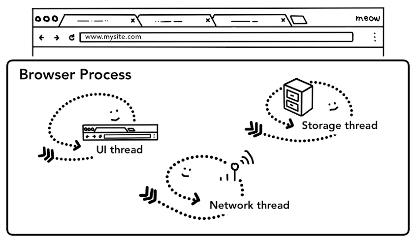

# Chrome의 내부 동작 2편

> **Create Date**: 2023/01/13  
> **Update Date**: 2023/01/16
>
> [Inside look at modern web browser (part2)](https://developer.chrome.com/blog/inside-browser-part2/)을 번역한 글입니다.  
> 오역이 있을 수 있습니다.

해당 글은 4부로 나뉘어 있으며 시리즈에서는 높은 수준의 아키텍처에서 렌더링 파이프라인의 세부 사항까지 Chrome 브라우저의 내부를 살펴볼 예정입니다.

이번 챕터는 Chrome의 내부 동작을 살펴보는 4부작 시리즈 중 2번째 파트입니다.

이 게시물에서는 웹 사이트를 표시하기 위해 각 Process와 Thread가 통신하는 방법에 대해 자세히 설명합니다.

웹 브라우징의 간단한 사용 사례를 먼저 보겠습니다.

저희가 브라우저에 URL을 입력하면 브라우저가 인터넷에서 데이터를 가져와 페이지를 표시합니다.

이 게시물에서는 사용자가 사이트를 요청하고 브라우저가 페이지를 렌더링할 준비하는 부분(내비게이션)에 중점을 둘 것입니다.

## Browser Process에서 시작하기

그림1: Browser UI에서 동작하는 Browser Process 다이어그램 / UI, 네트워크, Storage thread가 포함되어 있다.

part1에서 이야기했듯이 탭 외부의 모든 것은 Browser Process에서 처리됩니다.

Browser Process에는 브라우저의 버튼과 입력 창을 그리는 UI thread, 인터넷에서 데이터를 받기 위해 네트워크 스택을 처리하는 network thread, 파일에 대한 접근을 제어하는 storage thread가 있습니다.

주소창에 URL을 입력한 이후 발생되는 작업은 Browser Process의 UI thread에 의해 처리되는 작업입니다.

## 간단한 Navigation

### 1단계, input 처리

그림1: 입력이 검색어인지 URL인지 묻는 UI thread

사용자는 주소창에 무언가를 입력할 때, UI thread에게 “입력된 값이 검색어인가요? URL인가요?”를 먼저 묻습니다.

크롬의 주소창에는 검색어도 입력할 수 있으므로 UI thread는 사용자를 검색 엔진으로 보낼지 요청한 사이트로 보낼지 여부를 분석해서 결정해야 합니다.

### 2단계, 탐색 시작

사용자가 엔터키를 누르면 UI thread는 사이트의 컨텐츠를 가져오기 위해 네트워크 호출을 시작합니다.

로딩 스피너가 탭의 왼쪽에 표시되고 network thread는 DNS lookup과 TLS 연결 설정과 같은 적절한 프로토콜을 거치게 됩니다.

` 으로 페이지를 이동시키기 위해 network thread와 통신하는 UI thread](images/Chrome의-내부-동작-2편/Untitled%202.png)

그림2: `mysite.com` 으로 페이지를 이동시키기 위해 network thread와 통신하는 UI thread

중요한 점은 network thread는 HTTP 301과 같은 서버 리다이렉션 헤더를 수신할 수 있습니다.

그럴 경우에는 network thread는 서버가 리다이렉션을 요청하는 UI thread와 통신합니다.
그런 다음 다른 URL 요청이 시작됩니다.

### 3단계, 응답 읽기

그림3: Content-Type과 실제 데이터인 payload를 포함하는 응답 헤더

응답(payload)이 들어오기 시작하면 network thread는 필요한 경우 stream의 처음 몇 바이트를 확인합니다.

응답의 Content-Type 헤더는 보낼 데이터의 유형이 명시되어 있어야 하지만 누락되거나 잘못되어있을 수 있으므로 [**MIME 타입 스니핑**](https://developer.mozilla.org/ko/docs/Web/HTTP/Basics_of_HTTP/MIME_types)이 여기에서 수행됩니다.

- **MIME와 MIME 타입 스니핑이 궁금하다면 여기를 확인해보세요!**

  > 📝 **MIME란?**  
  > MIME는 Multipurpose Internet Mail Extensions의 줄임말입니다.  
  >  원래는 이메일에서 ASCII가 아닌 텍스트와 텍스트가 아닌 바이너리를 지원하도록 정의되었지만 MIME 표준에 정의된 Content-Type은 HTTP 프로토콜에서 요청 또는 응답의 컨텐츠 타입을 정의하는데에 사용됩니다.
  >
  > 

  > 📝 **MIME 타입 스니핑(MIME Sniffing)이란?**  
  > 때로 개발자는 보내는 데이터의 타입과 Content-Type을 다른 값으로 보내기도 하는데 브라우저는 웹 사이트가 의도한대로 작동하도록 잘못 표현된 리소스를 구문 분석하고 렌더링할 수 있습니다. 이 작업을 MIME Sniffing이라 합니다.
  >
  > 
  >
  > MIME Sniffing은 Content-Type 헤더에 의존하지 않고 응답 컨텐츠를 검사하여 웹 리소스의 효과적인 MIME 유형을 결정하기 위해 브라우저에서 채택하는 방식입니다. MIME 스니핑은 특정 조건에서만 수행됩니다. MIME 스니핑 알고리즘은 브라우저마다 다릅니다.

MIME 타입 스니핑은 [소스코드](https://source.chromium.org/chromium/chromium/src/+/main:net/base/mime_sniffer.cc;l=5)의 주석에도 나와있듯이 “tricky business”(까다로운 작업) 입니다.  
다른 브라우저는 Content-Type/payload 쌍을 어떻게 처리하는지 궁금하다면 위 소스코드의 주석을 확인해보세요!

응답이 만약 HTML 파일인 경우 다음 단계는 데이터를 renderer process에게 넘기는 작업입니다.

하지만 zip 파일이나 다른 파일일 경우 그 경우에는 다운로드 요청이기에 바로 download manager에게 데이터를 넘깁니다.

그림4: 응답 데이터가 안전한 사이트의 HTML인지 묻는 Network thread

여기서 [SafeBrowsing](https://safebrowsing.google.com/) 검사도 일어납니다.
도메인과 응답 데이터가 알려진 악성 사이트와 일치한다면 Network thread가 경고 페이지를 표시하도록 경고합니다.

또 민감한 사이트 간 데이터가 renderer process에게 전달되지 않도록 [**CORB (Cross Origin Read Blocking)**](https://www.chromium.org/Home/chromium-security/corb-for-developers/) 검사가 수행됩니다.

### 4단계, renderer process 찾기

한 번씩 확인이 끝났고 Network thread가 브라우저가 요청한 사이트로 이동해야 한다 확신하면 Network thread는 UI thread에게 데이터가 준비됐다 알립니다.

이후 UI thread는 웹 페이지를 렌더링할 renderer process를 찾습니다.

그림5: Renderer Process를 찾아달라고 UI thread에게 지시하는 Network thread

네트워크 요청이 응답을 받기까지 수백 밀리초가 걸릴 수 있으므로 이 작업의 속도를 높이기 위한 최적화가 적용됩니다. UI thread가 2단계에서 Network thread에 URL 요청을 보낼 때 이동할 사이트에 대해 이미 알고있기 때문에 최적화를 할 수 있습니다.

UI thread는 네트워크 요청과 병렬로 renderer process를 사전에 찾거나 시작하려 시도합니다.

모든 것이 예상대로 진행된다면 renderer process는 network thread가 데이터를 수신했을 때 이미 대기 위치에 있습니다.

탐색이 교차 사이트로 리다이렉션 되는 경우에는 이 대기 작업이 사용되지 않을 수 있으며 이 경우에는 다른 방법이 필요할 수 있습니다.

### 5단계, 네비게이션 바에 데이터 적용하기 (Commit Navigation)

그림6: 페이지 렌더링을 요청하는 browser와 renderer process간의 IPC

데이터와 renderer process가 준비되면 탐색을 커밋하기 위해 IPC가 browser process에서 renderer process에게 전송됩니다.

- **IPC가 궁금하시다면 여기를 확인해보세요!**
  > 📝 **IPC란?**  
  > 프로세스 간 통신(Inter-Process Communication)의 줄임말입니다.  
  > Process 사이에 서로 데이터를 주고 받는 행위 또는 그에 대한 방법이나 경로를 뜻합니다.  
  > Process는 완전히 독립된 실행 객체이므로 다른 Process의 영향을 받지 않는다는 장점이 있지만 독립되어 있는 만큼 별도의 설비 없이는 서로간의 통신이 어렵습니다.
  > 이를 위해 IPC를 사용하여 프로세스간 통신을 진행하게 됩니다.  
  > ](images/Chrome의-내부-동작-2편/Untitled%209.png)  
  > 출처: [https://jwprogramming.tistory.com/54](https://jwprogramming.tistory.com/54)

또한 renderer process가 HTML 데이터를 계속 수신할 수 있도록 데이터 스트림을 전달합니다.

browser process가 renderer process에서 커밋이 발생했다는 확인을 받으면 탐색이 완료되고 이제 문서를 로드를 시작합니다.

이때 주소 표시줄이 업데이트되고 보안 표시 및 사이트 설정 UI에 새 페이지 사이트 정보가 반영됩니다.

구글에서 네이버로 사이트 이동하는 움짤 / 주소 왼쪽 i로 표시되던 아이콘이 자물쇠로 바뀐다.

탭의 세션 기록이 업데이트되어 뒤로/앞으로 버튼이 방금 탐색한 사이트를 통해 이동할 수 있습니다.
탭이나 창을 닫을 때 탭/세션 복원을 용이하게 하기 위해 세션 기록이 디스크에 저장됩니다.

### 추가 단계: 초기 로드 완료

탐색이 커밋되면 renderer process는 리소스를 계속 로딩하며 페이지를 렌더링합니다.
이것이 어떻게 동작하는지에 대한 자세한 부분은 다음 글에서 다룰 예정입니다.

renderer process가 “완료”하면, renderer process는 IPC를 다시 browser process로 보냅니다.
(페이지의 모든 프레임에서 onload 이벤트가 실행되고 그 이벤트가 완료된 후 보냅니다.)

이때 UI thread가 로딩 스피너를 멈춥니다.

다만 클라이언트 측 JavaScript는 이 시점 이후에도 여전히 추가 리소스를 로드하고 새 뷰를 렌더링할 수 있기 때문에 “완료”라고 이야기합니다. (종료가 아닙니다)

그림7: 페이지가 “load”되었음을 알리기 위해 renderer에서 browser process로 IPC를 넘긴다.

## 다른 사이트로 이동하기

간단한 이동 예제는 끝났습니다! 하지만 사용자가 주소창에 다른 URL을 넣으면 어떻게 될까요?
browser process가 같은 단계를 지나며 다른 사이트로 이동하게 됩니다.

하지만 현재 렌더링된 사이트에 `beforeunload` 이벤트가 있는지 확인해야 합니다.

다른 곳으로 이동하거나 탭을 닫을 때 이벤트가 발생하기에 `beforeunload` 이벤트를 사용하면 “**정말 이 사이트를 나가시겠습니까..? 🥺**” 같은 alert 창을 만들 수 있습니다.

JavaScript 코드를 포함하여 탭 내부의 모든 것은 renderer process에 의해 처리되므로 browser process는 새 탐색 요청이 들어올 때 현재 renderer process를 확인해야 합니다.

> ⚠️ **주의**  
> 모든 상황에 `beforeunload` 핸들러를 추가하진 마세요. 왜냐하면 해당 이벤트는 페이지 이동이 일어나기 전에 핸들러를 실행해야 하므로 더 많은 지연시간이 소요됩니다.
>
> 이 이벤트 핸들러는 정말 당신이 필요할 때 추가하세요.  
> **페이지를 나가면 입력한 데이터가 손실될 수 있는 경우**가 적절한 예시입니다.
>
> ](images/Chrome의-내부-동작-2편/Untitled%2011.png)
>
> **출처**: [https://okky.kr/articles/682924](https://okky.kr/articles/682924)

그림8: Browser process에서 renderer process로의 IPC는 다른 사이트로 이동하려고 함을 알린다.

renderer process에서 페이지 이동이 시작된 경우(ex: 사용자가 링크를 클릭했거나 클라이언트 측 JavaScript에서 `window.location = "https://newsite.com"` 를 실행했을 경우) renderer process는 먼저 `beforeunload` 핸들러를 확인합니다.

그 다음 위의 탐색 단계를 다시 거칩니다.
유일한 차이점은 탐색 요청이 renderer process에서 browser process로 시작된다는 것입니다.

현재 렌더링된 사이트가 아닌 다른 사이트로 새 탐색이 수행되면 현재 renderer process는 `unload` 이벤트를 처리하기 위해 유지되고, 새로운 탐색을 위한 새로운 renderer process가 호출됩니다.

자세한 내용은 [페이지 수명 주기 상태에 대한 개요 문서](https://developer.chrome.com/blog/page-lifecycle-api/#overview-of-page-lifecycle-states-and-events)와 [Page Lifecycle API](https://developer.chrome.com/blog/page-lifecycle-api/)를 사용하여 이벤트에 연결하는 방법을 참조해보세요!

그림9: Browser Process에서 새 Renderer Process로 페이지 렌더링을 하고, 이전 Renderer Process에게는 unload를 이벤트를 지시하는 2개의 IPC

## 심화) Service Worker의 경우

탐색 방법에 대한 최근 변경 사항 중 하나는 [Service Worker](https://developer.chrome.com/docs/workbox/service-worker-overview/)의 도입입니다.

Service Worker는 어플리케이션 코드에서 네트워크 proxy를 추가하는 방법입니다.
웹 개발자가 로컬에 캐시할 항목과 네트워크에서 새 데이터를 가져올 시기를 더 잘 제어할 수 있습니다.

만약 Service Worker가 캐시를 통해 페이지를 로드하도록 설정하면 네트워크에서 데이터를 요청할 필요가 없습니다.

중요한 포인트는 Service Worker는 renderer process에서 실행되는 JavaScript코드라는 점입니다!

그렇다면 Browser Process는 사이트에 Service Worker가 있는지 어떻게 알 수 있을까요?

그림10: browser process의 service worker 영역을 확인하는 network thread

Service Worker가 등록되면 Service Worker Scope가 참조로 유지됩니다.
(범위에 대한 자세한 내용은 [Service Worker Lifecycle](https://web.dev/service-worker-lifecycle/) 문서를 확인해보세요.)

탐색이 발생하면 Network thread는 등록된 Service Worker Scope를 확인하고 Service Worker가 해당 URL에 등록된 경우 UI thread는 Service Worker 코드를 실행하기 위해 renderer process를 찾습니다.

Service Worker는 캐시에서 데이터를 로드하여 네트워크에서 데이터를 요청할 필요가 없도록 하거나 네트워크에서 새 리소스를 요청할 수 있습니다.

그림11: Service Worker를 처리하기 위해 renderer process를 시작하는 Browser process의 UI thread; renderer process의 Worker thread는 네트워크에서 데이터를 요청한다.

## 심화) Service Worker의 데이터 요청 속도 높이는 메커니즘

Service Worker가 결국 네트워크에서 데이터를 요청하기로 결정하면 Browser process와 renderer process간의 왕복으로 인해 지연이 발생할 수 있습니다.

[Navigation Preload](https://web.dev/navigation-preload/)는 Service Worker의 시작과 리소스 로드를 병렬로 처리하여 작업의 속도를 높이는 메커니즘입니다.

헤더에 이런 요청을 표시하여 서버로 하여금 이런 요청에 대해 다른 컨텐츠를 보낼 수 있도록 합니다. 이렇게 하면 전체 데이터를 가져오지 않고 업데이트된 데이터만 서버에서 받아오도록 할 수 있습니다.

그림12: Service worker를 처리하기 위해 renderer process를 시작하는 동시에 네트워크 요청을 병렬로 시작하는 Browser process의 UI thread

## 마무리

다음 게시물에서는 브라우저가 페이지를 렌더링하기 위해 HTML/CSS/JavaScript를 평가하는 방법에 대해 살펴보겠습니다.

## 참고 자료

- [https://developer.chrome.com/blog/inside-browser-part2/](https://developer.chrome.com/blog/inside-browser-part2/)
- [https://velog.io/@yebb/Browser-모던웹-브라우저-들여다보기-part2](https://velog.io/@yebb/Browser-%EB%AA%A8%EB%8D%98%EC%9B%B9-%EB%B8%8C%EB%9D%BC%EC%9A%B0%EC%A0%80-%EB%93%A4%EC%97%AC%EB%8B%A4%EB%B3%B4%EA%B8%B0-part2)
- [https://www.coalfire.com/the-coalfire-blog/mime-sniffing-in-browsers-and-the-security](https://www.coalfire.com/the-coalfire-blog/mime-sniffing-in-browsers-and-the-security)
- [https://www.techtarget.com/whatis/definition/MIME-Multi-Purpose-Internet-Mail-Extensions](https://www.techtarget.com/whatis/definition/MIME-Multi-Purpose-Internet-Mail-Extensions)
- [https://ko.wikipedia.org/wiki/프로세스*간*통신](https://ko.wikipedia.org/wiki/%ED%94%84%EB%A1%9C%EC%84%B8%EC%8A%A4_%EA%B0%84_%ED%86%B5%EC%8B%A0)
- [https://chromium.googlesource.com/chromium/src/+/main/docs/navigation.md](https://chromium.googlesource.com/chromium/src/+/main/docs/navigation.md)
