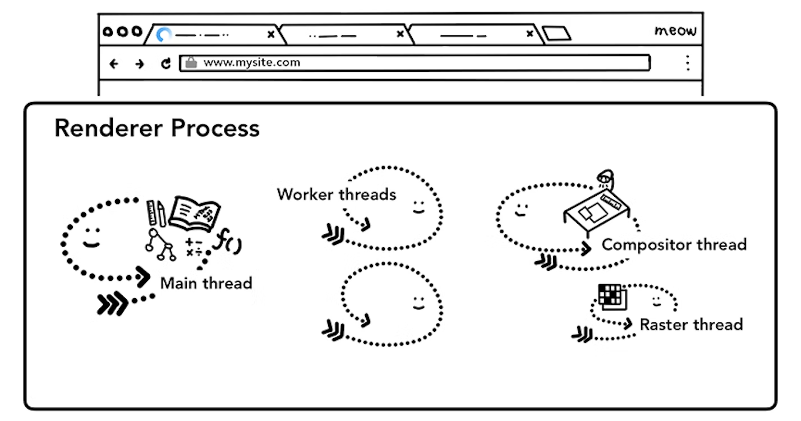

# Chrome의 내부 동작 3편

> **Create Date**: 2023/01/16  
> **Update Date**: 2023/01/17
>
> [Inside look at modern web browser (part3)](https://developer.chrome.com/blog/inside-browser-part3/)을 번역한 글입니다.  
> 오역이 있을 수 있습니다.

해당 글은 4부로 나뉘어 있으며 시리즈에서는 높은 수준의 아키텍처에서 렌더링 파이프라인의 세부 사항까지 Chrome 브라우저의 내부를 살펴볼 예정입니다.

이번 챕터는 Chrome의 내부 동작을 살펴보는 4부작 시리즈 중 3번째 파트입니다.

이 게시물에서는 renderer process 내부에서 어떤 일이 발생하는지 살펴보겠습니다.

renderer process는 웹 성능의 여러 측면과 관련이 있습니다. renderer process 내부에서는 많은 일이 발생하므로 이 게시물은 일반적인 개요이기에 더 자세히 알기 위해선 [웹 기초 성능 섹션](https://web.dev/why-speed-matters/) 글을 확인해보세요!

## 웹 컨텐츠를 처리하는 Renderer Process

renderer process는 탭 내부에서 발생하는 모든 일을 담당합니다.
renderer process에서 기본 thread는 사용자에게 보내는 대부분의 코드를 처리합니다.

web worker 또는 service worker를 사용하는 경우 JavaScript의 일부가 worker thread에 의해 처리되는 경우가 있습니다.

Compositor와 Raster thread 모두 renderer process 내부에서 실행되기에 페이지를 효율적이고 원활하게 렌더링합니다. (Compositor, Raster는 아래에서 자세히 이야기합니다)

Renderer Process의 핵심 작업은 HTML, CSS, JavaScript를 이용하여 사용자가 상호 작용할 수 있는 웹 페이지로 변환하는 것입니다.

그림1: main, worker, compositor, raster thread를 포함하는 Renderer Process

## 파싱 (Parsing)

### DOM의 구성

Renderer Process가 Navigation바에 정보를 등록했다는 메세지를 받고 (5단계, Commit Navigation) HTML 데이터를 받기 시작하면 main thread는 텍스트 문자열(HTML)을 분석하여 DOM (Document Object Model)으로 변환하기 시작합니다.

DOM은 페이지의 내부를 표현한 것일 뿐만 아니라 웹 개발자가 JavaScript를 이용해 상호 작용할 수 있도록 하는 데이터 구조이며 API라고 할 수 있습니다.

HTML 문서를 DOM으로 파싱하는 방법은 [HTML Standard](https://html.spec.whatwg.org/)에 의해 정의됩니다.
여러분들은 HTML을 브라우저에 제공하면 **오류가 발생하지 않는다**는 사실을 눈치챘을지도 모릅니다.

예를 들어 `
` 태그가 누락된 HTML도 유효한 HTML 파일입니다.

`Hi! <b>I'm <i>Chrome</b></i>` b 태그가 i 태그보다 먼저 닫힌 마크업도,
`Hi! <b>I'm <i>Chrome</i></b><i>!</i>` 이렇게 옳바르게 작성된 것처럼 처리됩니다.

이것은 모두 HTML Standard에서 오류를 정상적으로 처리되도록 설계하였기 때문입니다.
이 작업이 궁금하시다면 [parser의 오류 처리 및 이상한 마크업 처리 사례](https://html.spec.whatwg.org/multipage/parsing.html#an-introduction-to-error-handling-and-strange-cases-in-the-parser) 글을 읽어보세요!

### 하위 리소스 로드

웹사이트는 보통 외부의 리소스인 이미지, CSS, JavaScript를 사용합니다.
해당 파일들은 네트워크나 캐시에서 로드되어야 합니다.

main thread는 DOM을 만들기 위해 파싱하는 동안 찾는대로 하나씩 요청하는 방법을 사용할 수도 있지만 속도를 빠르게 하기 위해 “preload scanner(프리로드 스캐너)”가 동시에 실행됩니다.

HTML 문서에 `` 나 `<link>` 같은 것이 있다면 preload scanner는 HTML 파서가 생성한 토큰을 엿보고 Browser process의 network thread에 요청을 보냅니다.

그림2: HTML을 파싱하고 DOM tree를 만들고 있는 main thread

### 파싱을 멈출 수 있는 JavaScript

HTML parser는 `<script>` 태그를 만나면 HTML 문서 파싱이 잠시 멈추고 JavaScript 코드를 로딩, 파싱, 실행해야 합니다.

왜일까요?

왜냐하면 JavaScript는 `document.write()` 같은 것을 사용해서 문서의 모양을 바꿀 수 있기에 전체 DOM 구조를 바꿀 수 있기 때문입니다. (HTML 스펙에는 잘 표현된 다이어그램이 있습니다. [overview of the parsing model](https://html.spec.whatwg.org/multipage/parsing.html#overview-of-the-parsing-model) 글을 확인해보세요!)

이것이 HTML parser가 HTML 문서를 파싱하기 전에 JavaScript의 실행을 기다리는 이유입니다.

JavaScript 실행에서 어떤 일이 발생하는지 궁금하다면 [V8 팀의 블로그](https://mathiasbynens.be/notes/shapes-ics)를 참고해보세요.

## 리소스 로딩 방법을 브라우저에게 힌트로 넘기기

웹 개발자가 예상한대로 리소스를 로드하기 위해 브라우저에게 힌트를 넘길 수도 있습니다.

1. `document.write()` 를 사용하지 않는 경우 [async](https://developer.mozilla.org/ko/docs/Web/HTML/Element/script#attr-async) , [defer](https://developer.mozilla.org/ko/docs/Web/HTML/Element/script#attr-defer) 속성을 `<script>` 태그에 추가할 수 있습니다. 이 방법을 사용할 경우 브라우저는 JavaScript 코드를 비동기적으로 로드하고 실행하며 파싱을 멈추지 않습니다.
2. [JavaScript module](https://v8.dev/features/modules)을 사용할 수 있습니다.
3. `<link rel="preload">` 를 사용하면 리소스가 현재 탐색에 확실히 필요하고 가능한 빨리 다운로드하고 싶다 알릴 수 있습니다.
4. 그 밖에도 다양한 내용은 [Resource Prioritization - Getting the Browser to Help You](https://web.dev/fast/#prioritize-resources)에서 확인할 수 있습니다.

## 스타일 계산하기

CSS에서 페이지 요소의 스타일을 지정할 수 있으므로 DOM만으로는 페이지가 어떻게 보이는지 판단하기엔 충분하지 않습니다.

main thread는 CSS를 파싱하고 DOM의 노드마다 계산한 스타일을 결정합니다.

CSS 선택자를 기준으로 각 요소에 어떤 스타일이 적용되는지에 대한 정보가 존재하며 이 정보는 개발자 도구의 `computed` 섹션에서 확인할 수 있습니다.

- **Computed 섹션은 어디있나요?**
  

그림3: 계산된 스타일을 추가하기 위해 CSS를 파싱하는 main thread

만약 아무 CSS도 넣지 않더라도 각각의 DOM 노드에는 계산된 스타일이 있습니다.

`<h1>` 태그는 `<h2>` 보다 더 크게 보이며 각 요소에 따라 margin도 다릅니다.
왜냐하면 브라우저에서 지정하는 기본 스타일이 있기 때문입니다.

크롬의 기본 스타일은 여기 [소스코드](https://source.chromium.org/chromium/chromium/src/+/main:third_party/blink/renderer/core/html/resources/html.css)에서 확인하실 수 있습니다!

## 레이아웃 (Layout)

renderer process가 문서의 구조와 각 노드에 대한 스타일을 알게되었지만 페이지를 그리기에 충분하진 않습니다.

여러분이 친구와 통화하며 “도화지에 큰 빨간 원이 있고 작은 파란 사각형이 있어~”라고 이야기를 하면 친구가 정확하게 그림에 대해 인지할 수 있을까요?

아직은 부족할 것입니다.

그림4: 그림 앞에 있는 사람은 전화 줄로 다른 사람과 연결되어 있다.

레이아웃 작업은 요소의 기하학(geometry)적 구조를 찾는 과정입니다.

- **기하학… 이요?**  
  공간에 있는 도형의 성질, 즉 대상의 치수, 모양, 상대적 위치 등을 연구하는 수학의 한 분야입니다.
  ](images/Chrome의-내부-동작-3편/Untitled%205.png)  
  출처: [https://brunch.co.kr/@hotelyst/22](https://brunch.co.kr/@hotelyst/22)

main thread는 DOM, 계산된 스타일 값을 이용하여 x, y 좌표와 상자 크기 같은 정보가 있는 레이아웃 트리를 만듭니다.

레이아웃 트리는 DOM 트리 구조와 비슷할 수 있지만, 레이아웃 트리는 페이지에 표시되는 것과 관련된 정보만 포함합니다.

`display: none` 이 적용된 요소는 레이아웃 트리에 그려지지 않게 됩니다.
(`visibility: hidden` 은 레이아웃 트리에 그려집니다.)

비슷한 예제로 `p::before{content: "Hi!"}` 라는 CSS가 적용되면 DOM에는 없지만 레이아웃 트리에는 포함됩니다.

그림5: 계산된 스타일로 DOM 트리를 살펴보고 레이아웃 트리를 생성하는 main thread

https://user-images.githubusercontent.com/48716298/213723912-ce0bf948-4fa8-457d-8c82-b0d53447f327.mp4

그림6: 줄 바꿈이 변경되며 상자 레이아웃이 변경된다.

페이지의 레이아웃을 결정하는 작업은 어려운 작업입니다.

심지어 block이 위에서 아래로 흐르는 것 같은 간단한 페이지 레이아웃이라도 글자의 크기나 줄바꿈의 위치를 고려해야 합니다. 이런 값들이 paragraph의 크기와 위치, 모양 등을 결정짓기 때문입니다.

CSS는 요소를 한 쪽으로 [float](https://developer.mozilla.org/ko/docs/Web/CSS/float)할 수도 있고, 아이템을 [overflow](https://developer.mozilla.org/ko/docs/Web/CSS/overflow)할 수도 있으며, 글을 작성하는 방향을 변경할 수도 있습니다.

크롬 모든 팀은 레이아웃 작업을 위해 일하고 있습니다.
자세한 작업에 대해 알고 싶다면 [BlinkOn Conference에서 이야기한 내용](https://www.youtube.com/watch?v=Y5Xa4H2wtVA)을 살펴보세요!

## 페인트 (Paint)

그림7: 붓을 들고 캔버스 앞에 있는 사람, 원을 먼저 그려야하는지 사각형을 먼저 그려야하는지 고민중이다.

DOM, style, layout 작업이 끝났지만 아직 페이지를 그리기엔 부족해보입니다.

그림을 그린다고 가정해보겠습니다.
사이즈와 모양, 요소의 위치까지 알지만 그리는 순서를 판단해야 합니다.

예를 들어 특정 요소에 적용할 수 있는 `z-index` 는 HTML에 작성된 요소의 순서대로 그리게 되면 잘못된 페이지를 확인할 수 있습니다.

그림8: HTML 마크업 순서대로 페이지가 표현되어 z-index를 고려하지 않아 Block이 잘못 그려진 예시

페인트 단계에서 main thread는 레이아웃 트리를 이용해 페인트 레코드(paint records)을 만듭니다.
페인트 레코드는 “배경 먼저 그리기, 그 다음 문자, 그 다음 사각형…”과 같은 그리기 순서를 기록한 메모장입니다.

JavaScript를 이용해 `<canvas>` 요소에 그림을 그려본 경험이 있다면 이 작업이 익숙하실 수 있습니다.

그림9: 레이아웃 트리에서 이동하여 페인트 레코드를 생성하는 main thread

### 렌더링 파이프라인을 업데이트 하는 작업은 비용이 많이 듭니다.

https://user-images.githubusercontent.com/48716298/213724072-a096ac85-f6f8-40cf-9034-da702551abc7.mp4

그림10: DOM+Style, Layout, Paint 순서로 생성된다.

렌더링 파이프라인에서 파악해야 할 가장 중요한 부분은 **이전 단계의 결과를 이용하여 새로운 데이터를 생성한다는 부분**입니다!

예를 들어 레이아웃 트리에서 어떤 부분이 변경되면 문서의 영향 받는 부분은 페인트 레코드가 재생성됩니다.

만약 요소에 애니메이션을 추가한다면 브라우저는 모든 프레임 사이에 이런 작업을 수행하게 됩니다.

대부분의 디스플레이는 1초에 60번 새로고침 됩니다.(60fps)
매 프레임마다 스크린을 가로지르며 움직여야 애니메이션이 사람의 눈에 부드럽게 움직이는 것처럼 보입니다.

그러나 애니메이션 사이 프레임을 놓치면 페이지가 “버벅거려(janky)”보이게 됩니다.

그림11: 애니메이션 프레임을 표시한 타임라인

rendering 작업이 화면 새로고침을 따라가더라도 이런 계산은 main thread에서 실행되므로 애플리케이션이 JavaScript를 실행할 때 차단될 수 있습니다.

그림12: 애니메이션 프레임을 표시한 타임라인, 하지만 한 프레임은 JavaScript으로 인해 막혔다.

여러분은 JavaScript 작업을 작은 덩어리로 나눈 뒤 `requestAnimationFrame()` 을 사용하여 매 프레임마다 실행되도록 할 수 있습니다.

이 부분에 대한 자세한 내용은 [Optimize JavaScript Execution](https://web.dev/optimize-javascript-execution/)에서 확인할 수 있습니다.

또한 [JavaScript in Web Workers](https://www.youtube.com/watch?v=X57mh8tKkgE)를 통해 실행하면 main thread의 차단 현상을 막을 수 있습니다.

그림13: 애니메이션 프레임에 맞춰 애니메이션 타임라인에서 실행되는 더 작은 JavaScript 덩어리

## 합성 (Compositing)

### 페이지는 어떻게 그려질까요?

https://user-images.githubusercontent.com/48716298/213723655-d6263c65-44fc-463f-8020-37606ecf56d9.mp4

그림14: 간단한 래스터링(rastering) 작업 과정

이제 브라우저는 문서의 구조, 각 요소의 스타일, 페이지의 기하학, 페인트 순서를 알고 있습니다.
이젠 어떻게 페이지를 그리면 될까요?

이 정보를 **화면의 픽셀로 변환하는 작업**을 래스터화(rasterizing) 라고 합니다.

이런 것들을 다루는 간단한 방법은 뷰포트(viewport) 내부만 래스터(raster)하는 것입니다.
사용자가 페이지를 스크롤하면 래스터 프레임을 이동하고 빈 부분을 래스터링 합니다.

이 방법은 Chrome이 처음 출시되었을 때 래스터를 처리한 방법입니다.

그러나 최신 브라우저는 “합성(compositing)”이라는 더 정교한 작업 방식을 실행합니다.

### 합성(Compositing)은 무엇일까요?

https://user-images.githubusercontent.com/48716298/213723517-da982b58-52ee-46d2-afcd-0140bb7bbd11.mp4

그림15: 합성 작업 과정

합성은 페이지의 일부를 레이어로 분리하고 그것을 나눠서 래스터하고, compositor thread라고 불리는 별도의 thread에서 페이지로 합성(composite)하는 기술입니다.

스크롤을 하면 레이어가 이미 래스터 되어 있으므로 새로운 프레임에 합성하기만 하면 됩니다.

애니메이션은 레이어를 이동하고 새 프레임을 합성하여 동일한 방식으로 얻을 수 있습니다.

개발자 도구에 있는 Layers 패널을 사용하여 어떻게 웹사이트가 레이어로 구분되어 있는지 확인할 수 있습니다.
자세한 내용은 [Eliminate content repaints with the new Layers panel in Chrome](https://blog.logrocket.com/eliminate-content-repaints-with-the-new-layers-panel-in-chrome-e2c306d4d752/?gi=cd6271834cea) 글을 확인해보세요!

### 레이어로 나누기

어떤 요소가 어떤 레이어에 있는지 알아내기 위해 main thread는 레이아웃 트리를 통해 레이어 트리를 생성합니다. (개발자 도구의 Performance 패널에서는 “Update Layer Tree” 라고 부릅니다.)

별도의 레이어여야 하는 페이지의 특정 부분이 표시되지 않는 경우 CSS의 `will-change` 속성을 사용하여 브라우저에게 힌트를 줄 수 있습니다. (ex: 슬라이드 되는 사이드 메뉴)

그림16: 레이아웃 트리를 사용해 layer tree를 만드는 main thread의 모습

모든 요소에 레이어를 제공하고 싶을 수 있지만 너무 많은 레이어를 이용해 합성한다면 매 프레임 페이지의 작은 부분을 래스터화 하는 것보다 작업 속도가 느려질 수 있으므로 애플리케이션의 렌더링 성능을 측정하는 것이 중요합니다.

이 부분에 대한 자세한 내용은 [Stick to Compositor-Only Properties and Manage Layer Count](https://developers.google.com/web/fundamentals/performance/rendering/stick-to-compositor-only-properties-and-manage-layer-count)에서 확인할 수 있습니다.

### main thread의 Raster와 Composite

레이어 트리가 생성되고 페인트 순서가 결정되면 main thread는 해당 정보를 compositor thread에 커밋합니다.

compositor thread는 각 레이어를 래스터화 합니다.

레이어는 페이지의 전체 길이만큼 클 수 있으므로 compositor thread는 레이어를 타일로 나누고 각 타일을 raster thread에게 넘깁니다.

raster thread는 각 타일을 래스터화하여 GPU 메모리에 저장합니다.

그림17: 비트맵 형식의 타일을 생성하고 GPU에 보내는 Raster threads

compositor thread는 다른 raster thread의 우선 순위를 지정하여 viewport(혹은 근처)에 있는 항목을 먼저 래스터할 수 있습니다.

또 레이어에는 zoom-in과 같은 작업을 처리하기 위해 다양한 해상도로 타일링을 갖습니다.

타일이 래스터되면 compositor thread는 compositor frame을 생성하기 위해 드로우 쿼드(draw quads)라는 타일 정보를 수집합니다.

| Draw quads       | 페이지 구성을 고려하여 메모리에서 타일의 위치 및 페이지에서 타일을 그릴 위치와 같은 정보를 포함합니다. |
| ---------------- | ------------------------------------------------------------------------------------------------------ |
| Compositor frame | 페이지의 프레임을 나타내는 draw quad의 모음입니다.                                                     |

그 이후 compositor frame이 IPC를 통해 browser process에 제출됩니다.

이 시점에서 브라우저 UI 변경을 위해 UI thread에서 extension을 위해 다른 renderer process에서 다른 compositor frame을 추가할 수 있습니다.

이런 compositor frame은 GPU로 전송되어 화면에 표시됩니다.

스크롤 이벤트가 발생하면 compositor thread는 GPU로 보낼 다른 compositor frame을 생성합니다.

그림18: compositing frame을 생성하는 compositor thread, 프레임은 Browser process로 이동된 뒤 GPU로 전송된다.

합성의 이점은 main thread를 포함하지 않고 수행된다는 것입니다.

Compositor thread는 스타일 계산이나 JavaScript 실행을 기다릴 필요가 없습니다.

그래서 [애니메이션만 합성하는 것](https://web.dev/animations-guide/)이 부드러운 성능을 위한 최선의 방법으로 여겨지는 이유입니다.

만약 layout이나 paint를 다시 계산하는 경우엔 main thread가 필요해집니다.

## 마무리

마지막 게시물인 다음 게시물에서는 Compositor thread를 자세히 살펴보고 사용자 입력이 들어올 때 어떤 일이 발생하는지 확인할 예정입니다.

## 참고 자료

- [https://developer.chrome.com/blog/inside-browser-part3/](https://developer.chrome.com/blog/inside-browser-part3/)
- [https://velog.io/@yebb/Browser-모던웹-브라우저-들여다복-part3](https://velog.io/@yebb/Browser-%EB%AA%A8%EB%8D%98%EC%9B%B9-%EB%B8%8C%EB%9D%BC%EC%9A%B0%EC%A0%80-%EB%93%A4%EC%97%AC%EB%8B%A4%EB%B3%B5-part3)
- [https://ko.wikipedia.org/wiki/기하학](https://ko.wikipedia.org/wiki/%EA%B8%B0%ED%95%98%ED%95%99)
