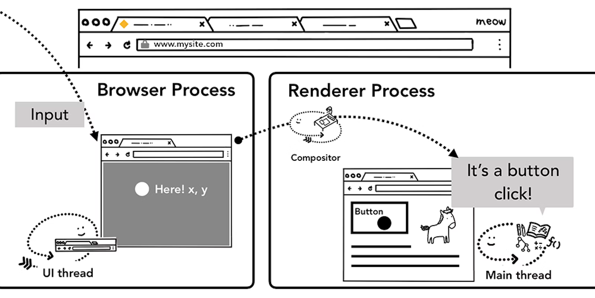

# Chrome의 내부 동작 4편

> **Create Date**: 2023/01/16  
> **Update Date**: 2023/01/20
>
> [Inside look at modern web browser (part4)](https://developer.chrome.com/blog/inside-browser-part4/)을 번역한 글입니다.  
> 오역이 있을 수 있습니다.

해당 글은 4부로 나뉘어 있으며 시리즈에서는 높은 수준의 아키텍처에서 렌더링 파이프라인의 세부 사항까지 Chrome 브라우저의 내부를 살펴볼 예정입니다.

이번 챕터는 Chrome의 내부 동작을 살펴보는 4부작 시리즈 중 마지막 파트입니다.

## **컴포지터가 사용자 입력을 받았을 때**

웹 사이트를 표시하기 위해 코드를 처리하는 방법에 대해 알아볼 예정입니다.

이전 게시물에서는 렌더링 작업 과정을 살펴보고 컴포지터(Compositing을 하는 thread)에 대해 알아보았습니다. 이번 게시물에서는 컴포지터가 사용자 입력이 들어올 때 어떻게 원활한 상호 작용을 가능하게 하는지 살펴보겠습니다.

## 브라우저 관점에서의 입력 이벤트

여러분은 “입력 이벤트”라고 하면 어떤 이벤트가 떠오르시나요?
텍스트 상자에 입력하거나 마우스를 클릭하는 이벤트가 떠오르시나요?

브라우저 관점에서 바라본다면 입력 이벤트는 사용자의 모든 제스처를 의미합니다.

마우스 휠을 움직이는 것도 입력 이벤트이고 터치하거나 마우스 오버도 입력 이벤트입니다.



그림1: browser process를 통해 renderer process로 라우팅되는 입력 이벤트

화면 터치 같은 사용자 제스처가 발생하면 Browser process가 먼저 제스처를 수신합니다.

그러나 탭 내부의 컨텐츠는 renderer process에 의해 처리되기에 browser process는 제스처가 발생한 위치만 인식합니다.

그렇기에 browser process는 event type(예를 들어 `touchstart` )와 좌표를 renderer process에게 보냅니다. Renderer process는 이벤트 대상을 찾고 연결된 리스너를 실행하여 이벤트를 적절하게 처리합니다.

## 컴포지터는 입력 이벤트를 수신합니다.

https://user-images.githubusercontent.com/48716298/213724482-f96b0020-ebb8-4486-9a2c-80c0a3650821.mp4

그림2: 페이지 레이어 위에 있는 viewport

이전 게시물에서 저희는 컴포지터가 래스터화된 레이어를 합성하여 부드럽게 스크롤하는 방법을 살펴보았습니다.

만약 이 페이지에 입력 이벤트 리스터가 첨부된 것이 없다면 컴포지터 thread는 새로운 main thread와 완전히 독립적인 새 합성 프레임을 생성할 수 있습니다.

하지만 입력 이벤트 리스너가 페이지에 첨부되어 있다면 어떨까요?

컴포지터 thread는 이벤트를 처리해야 하는지 어떻게 알 수 있을까요?

## 고속 스크롤 불가 영역 이해하기

JavaScript를 실행하는 것이 main thread의 일이므로 페이지가 합성되면 컴포지터 thread는 이벤트 핸들러가 연결된 페이지의 영역을 “Non-Fast Scrollable Region(고속 스크롤 불가 영역)”이라고 표시합니다.

웹 페이지의 이 영역에서 이벤트가 발생했을 때 컴포지터 thread가 입력 이벤트를 main thread로 보내야 하는지를 이 정보를 통해 확인할 수 있습니다.

입력 이벤트가 이 영역 밖에서 온다면 컴포지터 thread는 main thread를 기다리지 않고 새로운 프레임을 합성합니다.


그림3: 고속 스크롤 불가 영역에서 발생한 입력 이벤트를 설명하는 다이어그램

### 이벤트 핸들러를 작성할 때 주의해야 할 부분

웹 개발의 공통 이벤트 핸들링 패턴은 이벤트 위임입니다.

이벤트가 버블링되므로 최상위 요소에 하나의 이벤트 핸들러를 첨부하고 이벤트 대상에 따라 작업을 위임할 수 있습니다. 여러분은 아래와 비슷한 코드를 본 적이 있거나 작성해본 적이 있을 겁니다.

```javascript
document.body.addEventListener('touchStart', (event) => {
  if (event.target === area) {
    event.preventDefault();
  }
});
```

모든 요소에 대해 하나의 이벤트 핸들러만 작성하면 되므로 이벤트 위임 패턴이 매력적이게 느껴지기도 합니다.
그러나 이렇게 작성하게 되는 경우 브라우저에 관점에서 본다면 모든 페이지가 고속 스크롤 불가 영역이 됩니다.

즉 애플리케이션이 페이지의 특정 부분에서 입력 이벤트를 감지할 필요가 없더라도 컴포지터 thread는 입력 이벤트가 들어올 때마다 main thread와 통신하고 대기해야 합니다.

따라서 컴포지터의 부드러운 스크롤 기능이 손상됩니다.


그림4: 전체를 고속 스크롤 영역으로 포함한 페이지의 입력 다이어그램

이런 현상을 완화시키기 위해 이벤트 리스너에 `passive: true` 옵션을 추가할 수 있습니다.

이 옵션은 여전히 main thread에서 이벤트를 받지만 컴포지터가 main thread의 처리를 기다리지 않고 새 프레임을 만들어도 된다는 힌트를 브라우저에게 주는 옵션입니다.

```javascript
document.body.addEventListener(
  'touchStart',
  (event) => {
    if (event.target === area) {
      event.preventDefault();
    }
  },
  { passive: true }
);
```

## 이벤트 취소 가능 여부 확인


그림5: 가로 스크롤로 고정되어 있는 페이지

가로 스크롤만 할 수 있는 박스 영역을 떠올려보세요.

이때 위에서 이야기 했던 것처럼 이벤트에서 `passive: true` 옵션을 사용하면 부드럽게 스크롤됩니다.

하지만 스크롤 방향을 제한하기 위해 `preventDefault()` 메서드를 호출하기 전에 이미 수직 스크롤이 시작되었을 수도 있습니다.

이럴 경우 `event.cancelable()` 메서드를 이용하면 수직 스크롤 시작 여부를 확인할 수 있습니다.

```javascript
document.body.addEventListener(
  'pointermove',
  (event) => {
    if (event.cancelable) {
      event.preventDefault(); //기본 스크롤을 막습니다.
      /*
       * 동작하길 원하는 코드를 여기에 작성하세요!
       */
    }
  },
  { passive: true }
);
```

또는 `touch-action` 같은 CSS 규칙을 이용하여 이벤트 핸들러를 완전히 제거할 수 있습니다.

```javascript
#area {
	touch-action: pan-x;
}
```

## 이벤트가 일어난 요소 찾기


그림6: x, y 지점에 그려진 항목을 찾으려 페인트 레코드(paint records)를 보고 있는 main thread

컴포지터 thread가 main thread에게 입력 이벤트를 보낼 때 가장 먼저하는 일은 이벤트 대상을 찾는 히트 테스트 (hit test)입니다.

히트 테스트는 렌더링 과정에서 생성한 페인트 레코드를 사용하여 이벤트가 발생한 영역 아래에 어떤 영역이 존재하는지 찾습니다.

> 🤔 **왜 히트 테스트에서 레이아웃 트리가 아닌 페인트 트리(=페인트 레코드)를 사용하는 걸까요?**  
> clip, opacity, transform 등의 속성을 반영해야 이벤트의 대상을 정확히 알 수 있기에 페인트 레코드를 사용하는 것으로 보입니다.
>
> [https://d2.naver.com/helloworld/6204533](https://d2.naver.com/helloworld/6204533)

## 메인 스레드로 전달되는 이벤트 최소화하기

이전 글에서 일반적인 디스플레이 장치는 화면이 1초에 60번 새로 갱신된다는 것과 애니메이션을 화면 갱신 주기에 맞춰야 부드럽게 움직인다는 것을 이야기했습니다.

입력의 경우에는 일반적인 터치스크린 장치는 터치 이벤트를 초당 60~120번을 전달하고 마우스 이벤트의 경우에는 1초에 100번 이벤트를 전달합니다.

입력 이벤트의 전달 주기가 화면 갱신 주기보다 짧습니다.

위처럼 이벤트가 일어난다면 `touchmove` 는 초당 120회의 이벤트가 main thread에게 전달됩니다.
이렇게 되면 화면이 갱신되는 정도보다 과도한 양의 히트 테스트가 일어나거나 JavaScript를 실행할 수 있습니다.


그림7: 웹 페이지의 애니메이션 타임라인에 넘쳐 버벅거림을 유발하는 이벤트

main thread에 대한 과도한 호출을 최소화하기 위해 크롬은 `wheel` , `mousewheel` , `mousemove` , `pointermove` , `touchmove` 와 같은 연속적인 이벤트를 병합하여 바로 다음 `requestAnimationFrame()` 메서드 실행 직전까지 지연시킵니다.


그림8: 전과 같은 타임라인이지만 합쳐지고 지연되고 있는 이벤트

`keydown` , `keyup` , `mouseup` , `mousedown` , `touchstart` , `touchend` 와 같은 비연속적인(discrete) 이벤트는 즉시 전달됩니다.

## 한 프레임 안에 합쳐진 이벤트(intra-frame events)를 얻기 위해 `getCoalescedEvents()` 사용하기

대부분의 웹에서 이벤트를 합쳐서 처리하더라도 사용자가 만족스럽게 사용할 수 있습니다.

하지만 그림 그릴 수 있는 어플리케이션에서는 `touchmove` 좌표를 기반으로 경로를 배치하는 경우 사이사이 경로가 누락되어 매끄러운 선을 그리지 못할 수 있습니다.

이 경우에는 포인터 이벤트의 `getCoalescedEvents` 메서드를 사용하여 합쳐진 이벤트의 정보를 얻을 수 있습니다.


그림9: 매끄러운 터치 제스처 경로(왼쪽)와 합쳐진 경로(오른쪽)

```javascript
window.addEventListener('pointermove', event => {
	const events = event.getCoalescedEvents();
	for(let event of events) {
		const x = event.pageX;
		const y = event.pageY;
		// x, y 좌표를 이용하여 그릴 수 있습니다.
	}
}
```

## 다음 단계

이 시리즈를 통해 웹 브라우저의 내부 동작에 대해 알아보았습니다.

개발자 도구가 이벤트 핸들러에 `{passive: true}` 옵션을 추가하는 것을 권장하는 이유나 `<script>` 태그에 `async` 속성을 작성하는 이유에 대해 생각해본 적이 없을 수 있습니다.

이 시리즈를 통해 브라우저가 더 빠르고 부드러운 웹 경험을 위해 위와 같은 정보들이 필요하다는 것을 이해하는 계기가 되었으면 합니다.

### 1) Lighthouse를 사용하기

브라우저를 위해 여러분 코드를 멋지게 만들고 싶지만
어디서 시작해야 할 지 모르겠다면 [Lighthouse](https://developer.chrome.com/docs/lighthouse/overview/)를 사용해보세요.

Lighthouse는 웹 사이트의 잘 된 점과 개선할 점을 파악하여 결과를 보고서로 알려주는 도구입니다. 평가 항목에 무엇이 있는지 읽어보는 것만으로도 브라우저가 무엇을 신경 쓰는지 알 수 있을 것입니다.

### 2) 성능(performance) 측정하는 방법 알기

성능 개선 방법은 사이트마다 다르기에 웹 사이트의 성능을 측정하고 가장 적합한 방식을 결정할 수 있어야 합니다.

[크롬 개발자 도구 개발 팀이 작성한 튜토리얼](https://developer.chrome.com/docs/devtools/)에선 웹 사이트 성능을 측정하는 여러가지 방법을 확인할 수 있습니다.

### 3) 사이트에 기능 정책을 추가하기

[기능 정책](https://developer.chrome.com/blog/feature-policy/)(Feature policy)은 웹 플랫폼의 새로운 기능으로 프로젝트를 구축할 때 최소한의 방어책이 될 수 있습니다. 기능 정책을 사용하면 앱의 특정 동작을 보장하고 실수를 방지할 수 있습니다.

예를 들어 앱이 파싱을 차단하지 않도록 동작하려면 동기 스크립트 정책(synchronous scripts policy) 하에 앱을 실행할 수 있습니다.

`sync-script: 'none'` 이 활성화되면 파싱을 막을 수 있는 JavaScript가 실행되지 않습니다.
코드가 파서를 차단하는 것을 방지할 수 있고, 브라우저는 파서가 멈추는 것을 걱정할 필요가 없어집니다.

## 마무리


필자([Mariko Kosaka](https://twitter.com/kosamari))가 사이트를 만들기 시작했을 때에는 코드 작성 방법과 생산성 향상에만 신경을 썼습니다.

코드 작성과 생산성도 중요하지만 작성한 코드가 브라우저에서 어떻게 작동하는지도 생각해 보는 것이 좋습니다.

최신 브라우저는 사용자에게 더 나은 웹 경험을 제공하기 위해 여러 방법을 개발해 왔고 앞으로도 그럴 것입니다.

코드를 체계화해 브라우저에서 잘 작동하게 하면 사용자에게 좋은 경험을 제공할 수 있습니다.

브라우저에 친절하기 위한 탐구를 필자와 함께 하면 좋겠습니다!

## 참고 자료

- [https://developer.chrome.com/blog/inside-browser-part4/](https://developer.chrome.com/blog/inside-browser-part4/)
- [https://d2.naver.com/helloworld/6204533](https://d2.naver.com/helloworld/6204533)
