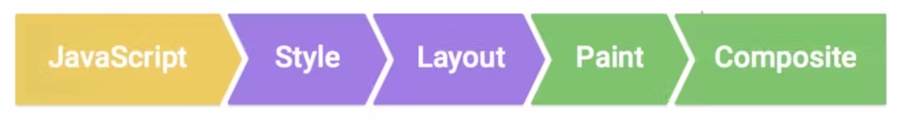

# Render Queue, Microtask Queue, Promise에 대하여

> **Create Date**: 2023/01/25
> **Update Date**: 2023/01/25
>
> [자바스크립트 등반 스터디](https://github.com/FECrash/JavaScript-Mountain) 발표 자료입니다.  
> [How Does JavaScript Even Work? Things Which 90% of JavaScript Developers Don't Know! (Part 2)](https://lightmap.dev/how-does-javascript-even-work-part-2) 글을 참고하여 작성되었으나, 오역이 있을 수 있습니다.

# Render Queue

Render Queue(이하 렌더 큐)는 **모든 화면 업데이트 혹은 repaint(이하 리페인트) 전에 수행해야 할 모든 작업**을 처리하는 이벤트 루프 시스템의 또 다른 큐 입니다.

브라우저가 정기적으로 이런 리페인트를 수행하기 때문에 모든 효과와 애니메이션이 발생합니다.

브라우저 작동 과정을 이해하신 분들이라면 리페인트 메커니즘이 어떤 순서로 동작하는지 아실겁니다.



위의 다이어그램은 자바스크립트 작업(리페인트 전 작업)과 리페인트와 관련된 4가지 주요 단계를 보여줍니다.
더 자세한 내용은 [브라우저 동작 과정](https://www.notion.so/a48f24437e9c46e783230ba97d14f5bf) 혹은 “[Browser Rendering Queue in-depth](https://frarizzi.science/journal/web-engineering/browser-rendering-queue-in-depth)” 글을 확인해보세요!

브라우저는 리페인트를 할 때마다 모든 단계를 수행하는 것은 아니며 변경된 사항이 있을 때만 수정합니다.

- **브라우저는 어떤 주기로 리페인트 할까요?**
  - 주요 브라우저는 일반적으로 초당 60회로(= 60FPS) 리페인트 작업을 진행합니다.
    눈이 더 빠른 변화를 인식할 수 없기에 일반적으로 60FPS을 사용합니다.

그러나 메인 스레드(main thread)가 유휴 상태이거나 호출 스택이 비어 있을 때만 이 속도로 리페인트할 수 있을 것입니다.

따라서 메인 스레드에서 실행 중인 작업이 있는 동안에는 리페인트가 발생할 수 없습니다.

그러기에 작업이 대기 중인 경우 브라우저는 교묘하게 몇 가지 작업을 진행한 후 렌더링 작업을 진행하고 빠르게 다시 돌아오는 방식으로 진행됩니다.

[싱글 스레드, Web API, 호출 스택, Task Queue에 대하여](https://www.notion.so/Web-API-Task-Queue-016abeb5321d45e39e882bfed2b67953) 해당 글에서 이야기 했던 무한 루프를 실행하여 호출 스택을 폭파시켰던 예제와 setTimeout을 통해 문제를 해결했던 예제를 기억하시나요?

setTimeout을 이용하면 해당 부분은 호출 스택이 비어있는 상황이 있기에 렌더 작업이 들어올 기회가 생겨 문제가 해결이 되었습니다.

[latentflip.com/loupe](https://lightmap.dev/latentflip.com/loupe) 사이트를 사용해 렌더 큐를 직접 화면으로 확인할 수 있습니다.

자바스크립트로 돌아가서 리페인트 전에 작업을 어떻게 Queue(이하 큐)에 넣을 수 있을까요?

자바스크립트에서는 렌더링 큐에 작업을 정렬할 수 있습니다.
또한 브라우저의 메서드(Web API) [requestAnimationFrame](https://developer.mozilla.org/en-US/docs/Web/API/window/requestAnimationFrame)를 사용하여 이런 작업을 정렬할 수 있습니다.

> requestAnimationFrame은 주요 브라우저에선 페인트 전에 작업을 정렬하지만 모든 렌더링 단계 이후 작업을 정렬하는 사파리는 다릅니다.
> 즉, 다음 렌더링 중에 작업이 실행되게 됩니다.

렌더 큐에는 실행 중에 무언가를 추가할 경우 다음 페인트 주기에 처리되도록 하는 속성이 있습니다.

지금까지는 Microtask Queue(이하 마이크로태스크 큐)에 들어가기 전 렌더링 큐와 이벤트 루프와 호출 스택과 함께 작동하는 큐에 대해 이야기하였습니다.

마이크로태스크 큐를 이해하기 위해선 ES6에서 새롭게 생긴 개념, Promise에 대해 알아야 합니다.

# Promises

이전 글에서 시간을 지연하는 작업이 성공적으로 실행되면 콜백으로 전달했습니다.
그러나 콜백 안에 콜백이 있고 그 안에 다시 콜백이 있다면 콜백 지옥(**callback hell**)에 빠질 수 있습니다.

](images/자바스크립트-동작-원리-2/Untitled%201.png)

**출처**: [https://dev.to/jerrycode06/callback-hell-and-how-to-rescue-it-ggj](https://dev.to/jerrycode06/callback-hell-and-how-to-rescue-it-ggj)

이를 방지하기 위해 Promise가 ES6에서 등장하였습니다.

Promise에는 3가지 상태가 있습니다.

1. **Resolved**, 작업이 완료된 상태를 의미합니다.
2. **Rejected**, 작업에 문제가 발생한 상태를 의미합니다.
3. **Pending**, 작업이 진행되고 있는 상태를 의미합니다.

```jsx
const p = new Promise((resolve, reject) => {
  const a = 1;
  if (!a) {
    reject(new Error('This Promise is Rejected'));
  } else {
    resolve('This Promise is resolved');
  }
});

p.then(() => {
  console.log('Successfully Resolved');
}).catch(() => {
  console.log('Rejected');
});
```

코드를 통해 Promise는 Reject와 Resolve라는 상태로 분기 처리를 하는 것을 확인할 수 있습니다.
작업이 성공적으로 실행되면 Resolve를, 그렇지 않으면 Reject를 호출합니다.

Promise에 `.then()` 메서드를 사용하면 promise가 resolve 상태일 때 해당 메서드 안에 있는 콜백을 실행하게 됩니다. 반면 `.catch()` 메서드를 사용하면 promise가 reject 상태일 때 거부 콜백이 실행됩니다.

`.finally()` 는 Promise의 상태 값이 확정된 뒤 실행되는 메서드입니다.

Promise는 Promise Chanining이라는 것을 이용해 콜백 지옥을 해결하고 async/await를 이용하여 비동기 함수에서 Promise를 처리할 수 있습니다.

지금은 JS 동작 방식에 집중하여 Promise와 .then(), .catch() 콜백을 처리하는 Queue에 대해 이해해봅시다!

# MicroTask Queue

Microtask Queue(= Job Queue, 이하 마이크로태스크 큐)는 기본적으로 Promise를 처리하는 흥미로운 Queue입니다.

마이크로태스크 큐는 태스크 큐와 렌더링 큐보다 우선 순위가 높습니다.
즉, 마이크로태스크 큐의 작업이 먼저 실행됩니다.

호출 스택이 비게되면 이벤트 루프는 마이크로태스크 큐에 작업이 있는지 확인하고 작업이 있다면 해당 작업을 완료합니다.

마이크로태스크 큐의 우선 순위가 가장 높기에 모든 작업을 완료할 때까지 이벤트 루프는 마이크로태스크 큐의 작업을 진행하게 됩니다.

이 동작으로 인해 무한 루프와 유사한 코드가 작성될 수 있습니다.

```jsx
function blockEventLoop() {
  Promise.resolve().then(blockEventLoop);
}

const btn = document.getElementById('kill');
btn.addEventListener('click', blockEventLoop, false);
```

id가 kill인 버튼을 누르면 모든 작업이 얼게 됩니다.
작동 순서를 통해 이유를 알아봅시다.

1. 스크립트가 실행되고 btn에 click 이벤트가 추가됩니다.
2. id가 kill인 버튼을 누릅니다.
3. 이벤트 리스너가 호출되고 큐에 `blockEventLoop` 함수가 추가됩니다.
4. 호출 스택은 비어있는 상태이므로 이벤트 루프가 promise를 호출 스택으로 가져오고 실행하는 동안 다른 promise가 큐에 추가되는 작업이 반복됩니다.
5. 그렇기에 메인 스레드는 쉬지 않고 일하며 이로 인해 정지된 화면으로 보이게 됩니다.

다른 예시를 하나 더 확인해봅시다! (출처: JSConf)

```jsx
const button = document.getElementById('run');

button.addEventListener('click', () => {
  Promise.resolve().then(() => {
    console.log('MicroTask 1');
  });
  console.log('Listener 1');
});
button.addEventListener('click', () => {
  Promise.resolve().then(() => {
    console.log('MicroTask 2');
  });
  console.log('Listener 2');
});
```

- **버튼을 클릭할 경우 콘솔 창에는 어떤 결과가 출력될까요?**
  Listener 1
  MicroTask 1
  Listener 2
  MicroTask 2

출력이 직관적이지 않으므로 실행 순서를 확인해봅시다!

1. 스크립트가 실행되고 이벤트 리스너가 버튼에 추가됩니다.
2. 버튼을 클릭하면 첫 번째 이벤트 리스너가 호출 스택에 추가됩니다.
3. Promise가 resolve되고 콜백이 마이크로태스크 큐로 넘어갑니다. 그 이후 `Listener 1` 이 출력됩니다.
4. 첫 번째 이벤트 리스너가 호출 스택에서 제거되고 호출 스택이 비게 됩니다.
   그 이후 마이크로태스크의 작업이 호출 스택으로 넘어와 `MicroTask 1` 이 출력됩니다.
5. 두 번째 이벤트 리스너도 동일합니다.
6. 실행이 종료됩니다.

그래서 JS의 마이크로태스크는 무엇일까요?

1. [Promises](https://developer.mozilla.org/en-US/docs/Web/JavaScript/Reference/Global_Objects/Promise)
2. [Mutation Observers](https://developer.mozilla.org/en-US/docs/Web/API/MutationObserver)
3. [queueMicrotask()](https://developer.mozilla.org/en-US/docs/Web/API/queueMicrotask)

# Queue 정리하기

- **Task Queue**
  - 작업이 한 번에 하나씩 실행됩니다.
  - 이동 전 모든 작업이 완료되어야 한다는 규칙은 없습니다.
- **Render Queue**
  - 이벤트 루프가 렌더 큐에 오면 존재하는 모든 작업을 완료하고 이벤트 루프가 시작된 후 작업이 추가되면 해당 작업은 다음 차례로 넘기게 됩니다.
- **Microtask Queue**
  - 해당 큐는 모든 작업이 없어질 때까지 실행됩니다.
    그렇기에 Promise가 무한 재귀를 실행하면 메인 스레드가 차단됩니다.

# 모든 Queue가 사용되는 예시

```jsx
function log(arg) {
  console.log(arg);
}

// Function which will add a callback to task queue using setTimeout
function taskQueue(number, callback) {
  setTimeout(function () {
    callback(`Timeout ${number}`);
  }, 0);
}

// Function which will return a promise
function microTaskQueue(number) {
  return Promise.resolve(`Promise ${number}`);
}

// Pushing to microtask queue
microTaskQueue(1).then(log);
microTaskQueue(2).then(log);

// Pushing to task queue
taskQueue(1, log);

// Pushing to render queue
requestAnimationFrame(function () {
  log('RequestAnimationFrame 1');
});

//Normal code to show that the script will run till completion first
for (let i = 0; i < 100000000; i++) {}
console.log('The end');
```

순서를 이해해봅시다!

1. 먼저 `microTaskQueue(1).then(log)` / `microTaskQueue(2).then(log)` 를 호출합니다.
   두 log 함수는 마이크로태스크 큐에 들어갑니다.
2. setTimeout API를 통해 태스크 큐에 log 함수를 추가하는 `taskQueue(1, log)` 를 호출합니다.
3. 렌더 큐에 log 함수를 추가하는 `requestAnimationFrame()` 함수를 호출합니다.
4. for문이 실행되고 `The end` 가 출력됩니다.
5. 이제 호출 스택이 비었으므로 이벤트 루프가 나타납니다.
6. 첫 번째는 마이크로태스크 큐가 가장 우선 순위가 높으므로 마이크로태스크 큐의 log 함수를 통해 `Promise 1` , `Promise 2` 가 출력됩니다.
7. 그 다음 브라우저가 렌더 큐로 이동하여 `RequestAnimationFrame 1`이 출력됩니다.
8. 마지막으로 태스크 큐로 이동하여 `Timeout 1` 이 출력됩니다.

마지막으로 이벤트 루프를 코드로 표현해보자면 아래와 비슷할 것 입니다.


**출처**: JSConf

# 이 이야기를 듣고 더 궁금한 점이 생겼다면…

[https://jakearchibald.com/2015/tasks-microtasks-queues-and-schedules/](https://jakearchibald.com/2015/tasks-microtasks-queues-and-schedules/)

위 블로그를 확인하여 큐의 동작이 브라우저마다 어떻게 차이가 있는지 애니메이션을 통해 확인하실 수 있습니다!

# 참고 자료

- [https://lightmap.dev/how-does-javascript-even-work-part-2](https://lightmap.dev/how-does-javascript-even-work-part-2)
- [https://www.youtube.com/watch?v=8aGhZQkoFbQ](https://www.youtube.com/watch?v=8aGhZQkoFbQ)
- [https://www.youtube.com/watch?v=cCOL7MC4Pl0](https://www.youtube.com/watch?v=cCOL7MC4Pl0)
